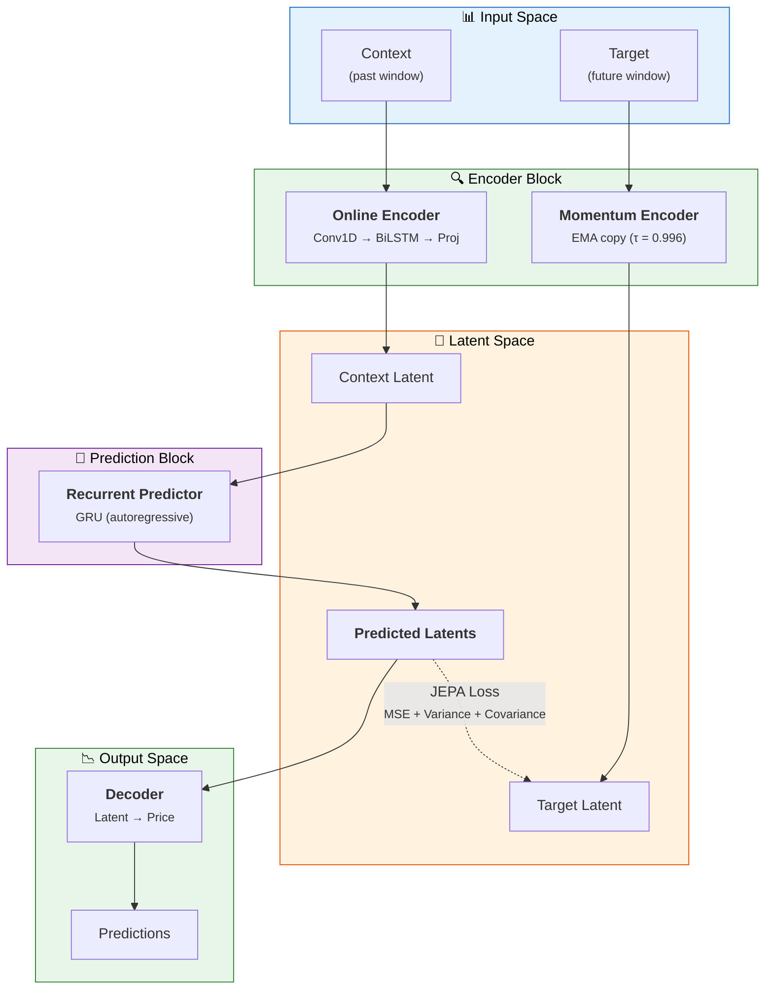

# 📈 R-JEPA Stock Price Prediction

<p align="center">
  <b>Recurrent Joint Embedding Predictive Architecture</b> for stock market forecasting
</p>

<p align="center">
  
  
  
</p>

> Built with modern Python features: `@dataclass(slots=True)`, `Self` type, `X | None` unions, `match/case`, `pathlib`, typed `Tensor` annotations.

---

## 📋 Overview

This project implements an **R-JEPA** model for stock price prediction. R-JEPA combines two powerful ideas:

| Component | Description |
|-----------|-------------|
| **JEPA** (Joint Embedding Predictive Architecture) | Predict abstract latent representations of future market states instead of raw prices — more robust and sample-efficient |
| **Recurrent Processing** | GRU networks capture temporal dependencies in market dynamics |

### ✨ Key Features

- **Self-supervised learning** — no labeled data required
- **Latent space prediction** — more robust than direct price prediction
- **Ensemble predictions** — uncertainty estimation with 95% confidence intervals
- **Technical indicators** — automatically engineered features (RSI, MA, volatility, etc.)
- **Multi-ticker support** — train on multiple stocks simultaneously
- **AMP training** — Automatic Mixed Precision for faster GPU training
- **Early stopping** — prevents overfitting

---

## 🏗️ Architecture



### 🎯 Training Objective

Minimize the distance between **predicted latents** and **target latents** in embedding space, while preventing representation collapse through variance and covariance regularization.

---

## 🚀 Installation

```bash
# Python 3.13+ required
python --version  # should be >= 3.13

# Install dependencies
pip install -r requirements.txt
```

### Dependencies

| Package   | Minimum version |
|-----------|-----------------|
| Python    | 3.13+           |
| PyTorch   | ≥ 2.6           |
| yfinance  | ≥ 0.2           |
| pandas    | ≥ 2.2           |
| numpy     | ≥ 2.2           |
| scikit-learn | ≥ 1.6        |
| matplotlib   | ≥ 3.10      |
| pyyaml       | ≥ 6.0       |
| tqdm         | ≥ 4.67      |

---

## 💻 Usage

### ⚙️ Configuration

Edit [`config/config.yaml`](config/config.yaml) to configure:

- **Data**: Stock tickers, date range, sequence length, features
- **Model**: Encoder/predictor dimensions, latent space size
- **Training**: Learning rate, epochs, early stopping patience

### 🏋️ Training

```bash
# Train with default config (AAPL, MSFT, GOOGL from 2015–2024)
python run_training.py

# Train with custom parameters
python run_training.py \
    --ticker AAPL \
    --start 2020-01-01 \
    --end 2024-12-31 \
    --epochs 50 \
    --batch_size 32 \
    --lr 0.0005 \
    --seq_len 60 \
    --pred_horizon 10 \
    --latent_dim 128
```

The training script will:

1. 📥 Download historical stock data via Yahoo Finance
2. 🔧 Engineer technical indicators (RSI, MA, volatility, etc.)
3. 📊 Normalize and create sequence pairs
4. 🧠 Train the R-JEPA model with JEPA loss
5. 💾 Save checkpoints to `./checkpoints/`
6. 📈 Generate training history plots

### 🔮 Prediction

```bash
# Predict using trained model
python run_prediction.py \
    --checkpoint checkpoints/checkpoint_best.pt

# Custom prediction
python run_prediction.py \
    --checkpoint checkpoints/checkpoint_best.pt \
    --ticker AAPL \
    --horizon 10 \
    --ensemble_size 20 \
    --output predictions.csv \
    --plot predictions.png
```

The prediction script will:

1. 📤 Load the trained model
2. 📉 Use the most recent data as context
3. 🎯 Generate predictions with confidence intervals
4. 💾 Save predictions to CSV
5. 🖼️ Generate visualization plots

---

## 📁 Project Structure

```
jepaagent/
├── 📦 pyproject.toml              # Project metadata & tool config
├── 📜 config/config.yaml          # Configuration file
├── 📁 data/
│   ├── __init__.py
│   ├── py.typed                   # PEP 561 typed package marker
│   └── stock_data.py              # Data loading, preprocessing, datasets
├── 📁 models/
│   ├── __init__.py
│   ├── py.typed
│   ├── encoder.py                 # Time series encoder + momentum encoder
│   ├── predictor.py               # Recurrent predictor (GRU)
│   ├── decoder.py                 # Latent-to-price decoder
│   └── r_jepa.py                  # Main R-JEPA model
├── 📁 training/
│   ├── __init__.py
│   ├── py.typed
│   ├── loss.py                    # JEPA loss with regularization
│   └── trainer.py                 # Training loop, checkpointing
├── 📁 utils/
│   ├── __init__.py
│   ├── py.typed
│   └── metrics.py                 # Evaluation metrics + plotting
├── ▶️  run_training.py            # Training script
├── ▶️  run_prediction.py          # Prediction script
├── 📋 requirements.txt            # Python dependencies
└── 📖 README.md                   # This file
```

---

## 🧠 Model Details

### 🔍 Encoder

| Layer | Description |
|-------|-------------|
| **1D Convolutions** | Extract local patterns (3-day, 5-day movements) |
| **Bidirectional LSTM** | Capture forward and backward temporal dependencies |
| **Layer Normalization** | Stable training |

### 🔄 Recurrent Predictor

| Feature | Description |
|---------|-------------|
| **GRU-based** | Efficient autoregressive prediction in latent space |
| **Context aggregation** | Uses full latent sequence for richer predictions |
| **Noise injection** | Optional for ensemble uncertainty estimation |

### ⚖️ JEPA Loss

| Component | Weight | Purpose |
|-----------|--------|---------|
| **Prediction loss (MSE)** | 1.0 | Minimize distance between predicted and target latents |
| **Variance regularization** | 0.5 | Prevent representation collapse |
| **Covariance regularization** | 0.1 | Decorrelate latent dimensions |

### 🏃 Momentum Encoder

- EMA-updated copy of the online encoder
- Provides **stable targets** for self-supervised learning
- Updated with: `θ_momentum = τ · θ_momentum + (1 − τ) · θ_online`
- Default `τ = 0.996` — slow update for training stability

---

## 📊 Performance Metrics

| Metric | Description |
|--------|-------------|
| **MAE / MSE / RMSE** | Standard error metrics |
| **MAPE** | Mean Absolute Percentage Error |
| **R²** | Coefficient of determination |
| **Directional Accuracy** | Percentage of correctly predicted price direction |
| **Sharpe Ratio** | Risk-adjusted return metric |

---

## 🐍 Python 3.13 Features Used

| Feature | Example |
|---------|---------|
| `@dataclass(slots=True, frozen=True)` | [`StockDataConfig`](data/stock_data.py:32) |
| `from __future__ import annotations` | All modules |
| `list[X]` / `dict[K, V]` / `tuple[X, ...]` | Throughout (PEP 585) |
| `X \| None` instead of `Optional[X]` | [`encoder.py`](models/encoder.py:37) |
| `match/case` | [`run_training.py`](run_training.py:37) |
| `pathlib.Path` | [`trainer.py`](training/trainer.py:56) |
| `collections.abc` for generic types | [`stock_data.py`](data/stock_data.py:10) |
| `lerp_()` for EMA updates | [`encoder.py`](models/encoder.py:92) |
| `torch.compile` compatible | All modules |

---

## 📚 References

- [A Path Towards Autonomous Machine Intelligence (Y. LeCun, 2022)](https://openreview.net/pdf?id=BZ5a1r-kVsf)
- [Self-Supervised Learning from Images with JEPA (Assran et al., 2023)](https://arxiv.org/abs/2301.08243)
- [VICReg: Variance-Invariance-Covariance Regularization (Bardes et al., 2021)](https://arxiv.org/abs/2105.04906)

---

## ⚠️ Disclaimer

**WARNING:** Stock price prediction is inherently uncertain. This model is for **research and educational purposes only**. Do not use it for real trading decisions without proper validation and risk management.
