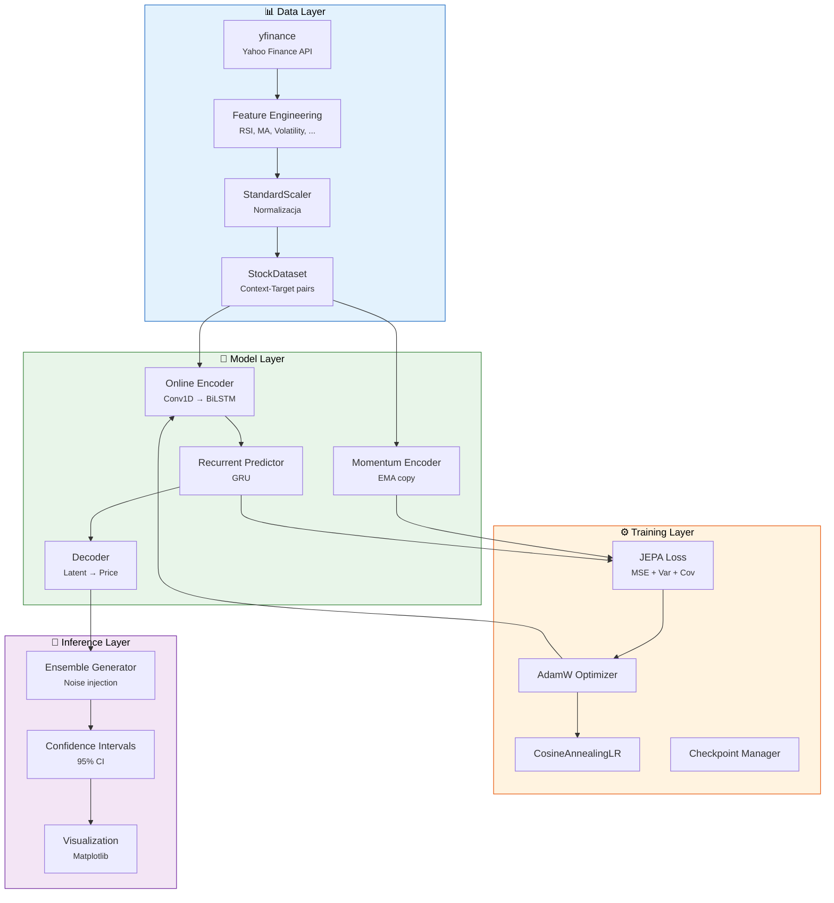
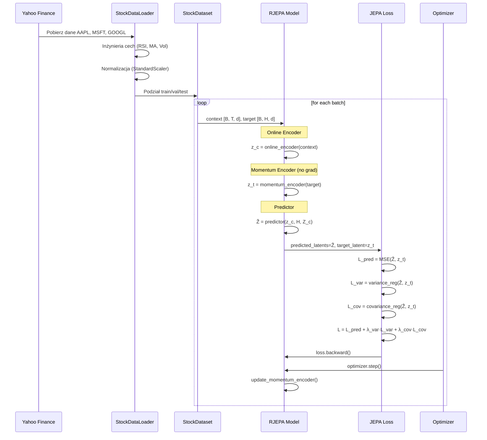
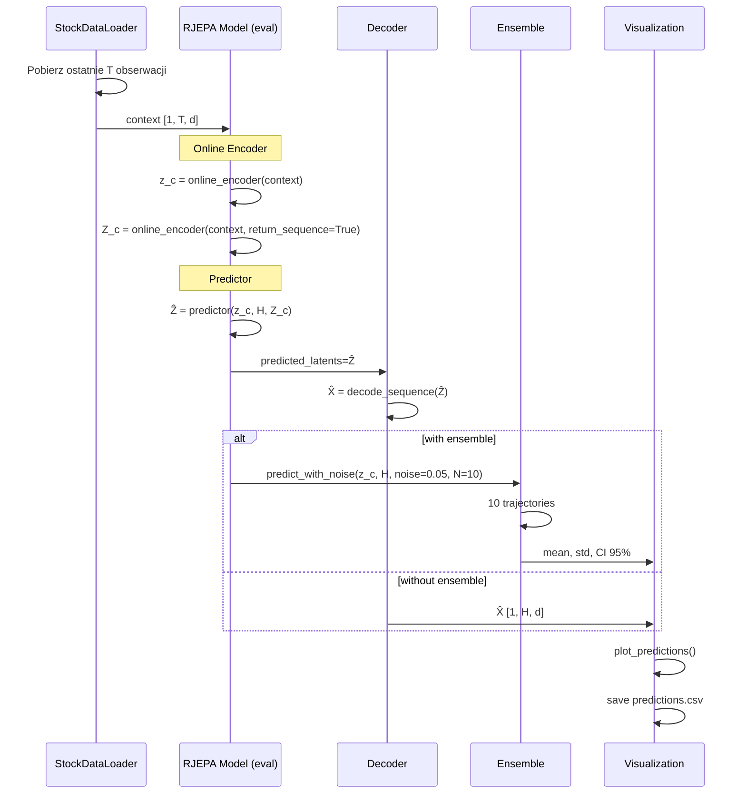
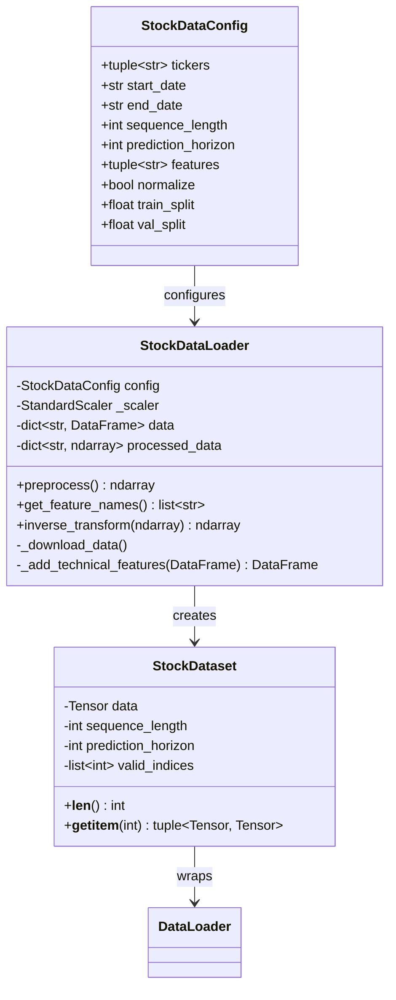
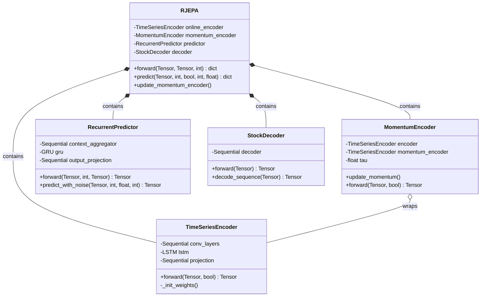
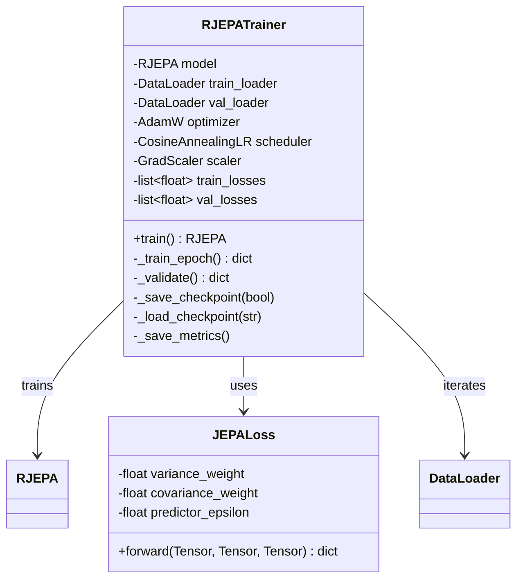
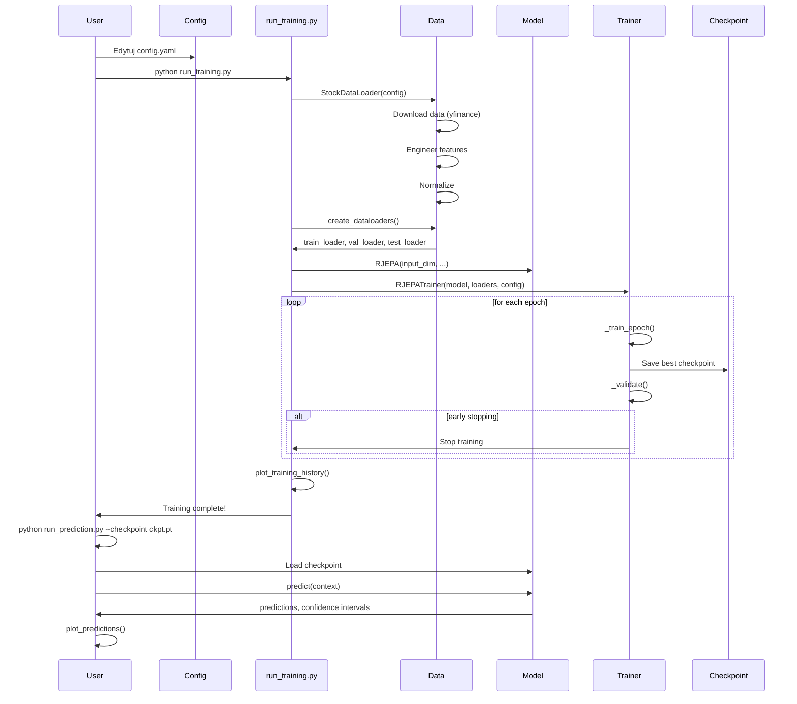

# 🏗️ Architektura R-JEPA

> Diagramy architektury, przepływy danych i komponenty systemu.

---

## Spis treści

- [🏗️ Architektura R-JEPA](#️-architektura-r-jepa)
  - [Spis treści](#spis-treści)
  - [1. Architektura wysokiego poziomu](#1-architektura-wysokiego-poziomu)
    - [1.1 Diagram główny](#11-diagram-główny)
    - [1.2 Komponenty według warstw](#12-komponenty-według-warstw)
  - [2. Przepływ danych](#2-przepływ-danych)
    - [2.1 Przepływ treningowy](#21-przepływ-treningowy)
    - [2.2 Przepływ inferencyjny](#22-przepływ-inferencyjny)
  - [3. Komponenty systemu](#3-komponenty-systemu)
    - [3.1 StockDataLoader](#31-stockdataloader)
    - [3.2 Model R-JEPA](#32-model-r-jepa)
    - [3.3 Training](#33-training)
  - [4. Tryb treningowy vs inferencyjny](#4-tryb-treningowy-vs-inferencyjny)
  - [5. Diagram sekwencji — pełny cykl życia](#5-diagram-sekwencji--pełny-cykl-życia)
  - [6. Zależności między modułami](#6-zależności-między-modułami)

---

## 1. Architektura wysokiego poziomu

### 1.1 Diagram główny



### 1.2 Komponenty według warstw

| Warstwa | Klasa/Funkcja | Plik | Odpowiedzialność |
|---------|--------------|------|------------------|
| **Data** | `StockDataLoader` | [`data/stock_data.py`](../data/stock_data.py) | Pobieranie danych z Yahoo Finance |
| **Data** | `StockDataset` | [`data/stock_data.py`](../data/stock_data.py) | Tworzenie par context-target |
| **Data** | `create_dataloaders` | [`data/stock_data.py`](../data/stock_data.py) | Podział train/val/test |
| **Model** | `TimeSeriesEncoder` | [`models/encoder.py`](../models/encoder.py) | Enkoder czasowy (Conv1D + BiLSTM) |
| **Model** | `MomentumEncoder` | [`models/encoder.py`](../models/encoder.py) | Kopiia enkodera z aktualizacją EMA |
| **Model** | `RecurrentPredictor` | [`models/predictor.py`](../models/predictor.py) | Predyktor GRU w latent space |
| **Model** | `StockDecoder` | [`models/decoder.py`](../models/decoder.py) | Dekoder latent → ceny |
| **Model** | `RJEPA` | [`models/r_jepa.py`](../models/r_jepa.py) | Główny model łączący komponenty |
| **Training** | `JEPALoss` | [`training/loss.py`](../training/loss.py) | Funkcja straty JEPA |
| **Training** | `RJEPATrainer` | [`training/trainer.py`](../training/trainer.py) | Pętla treningowa |
| **Utils** | `compute_prediction_metrics` | [`utils/metrics.py`](../utils/metrics.py) | Metryki ewaluacyjne |
| **Utils** | `plot_predictions` | [`utils/metrics.py`](../utils/metrics.py) | Wizualizacja predykcji |

---

## 2. Przepływ danych

### 2.1 Przepływ treningowy



### 2.2 Przepływ inferencyjny



---

## 3. Komponenty systemu

### 3.1 StockDataLoader



### 3.2 Model R-JEPA



### 3.3 Training



---

## 4. Tryb treningowy vs inferencyjny

| Aspekt | Trening | Inferencja |
|--------|---------|------------|
| **Model** | `model.train()` | `model.eval()` |
| **Encoder** | Online + Momentum | Tylko Online |
| **Target** | Wymagany (`target` tensor) | Nie wymagany |
| **Momentum update** | Tak (po każdym batchu) | Nie |
| **AMP** | Tak (GradScaler) | Nie |
| **Gradient** | Wymagany | `torch.no_grad()` |
| **Decoder** | Opcjonalny | Wymagany (do wizualizacji) |
| **Ensemble** | Nie | Opcjonalnie |
| **Confidence intervals** | Nie | Tak (przy ensemble) |

---

## 5. Diagram sekwencji — pełny cykl życia



---

## 6. Zależności między modułami

```
run_training.py
    ├── data/stock_data.py
    │       └── yfinance, pandas, sklearn
    ├── models/r_jepa.py
    │       ├── models/encoder.py
    │       │       └── torch.nn (Conv1d, LSTM, Linear, LayerNorm)
    │       ├── models/predictor.py
    │       │       └── torch.nn (GRU, Linear, LayerNorm)
    │       └── models/decoder.py
    │               └── torch.nn (Linear, LayerNorm)
    ├── training/trainer.py
    │       ├── training/loss.py
    │       │       └── torch.nn.functional (mse_loss)
    │       └── torch.optim (AdamW, CosineAnnealingLR)
    └── utils/metrics.py
            └── matplotlib, numpy

run_prediction.py
    ├── data/stock_data.py
    ├── models/r_jepa.py
    └── utils/metrics.py
```
