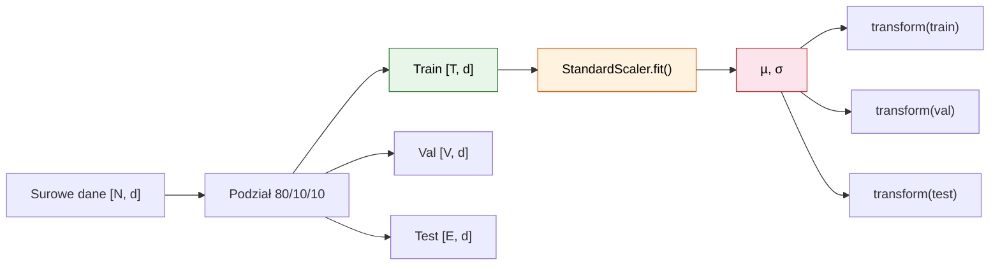
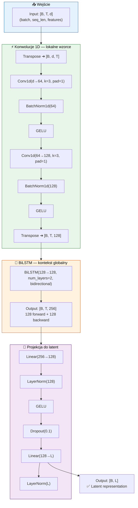
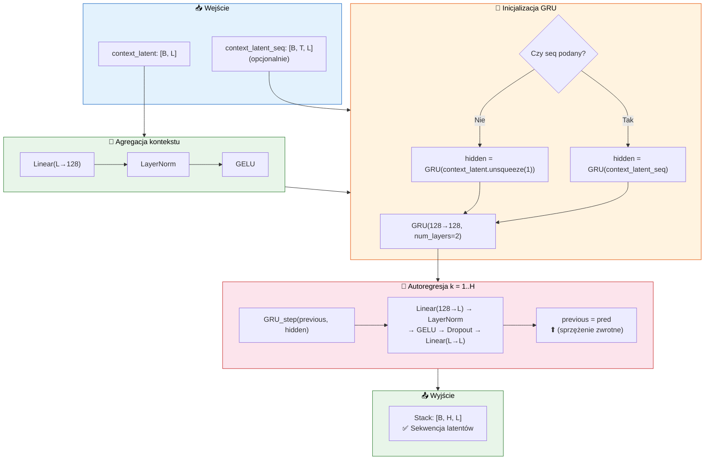
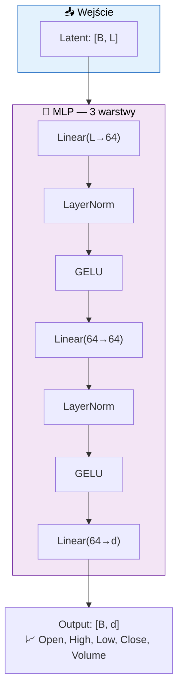
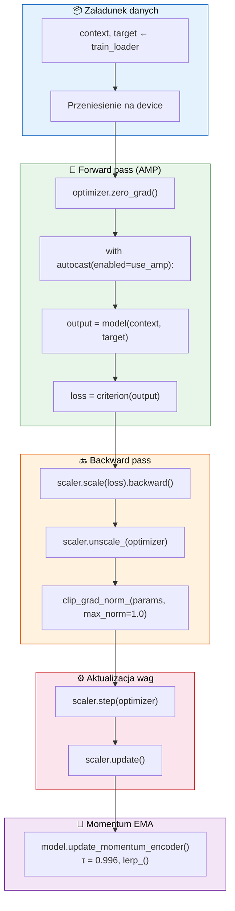
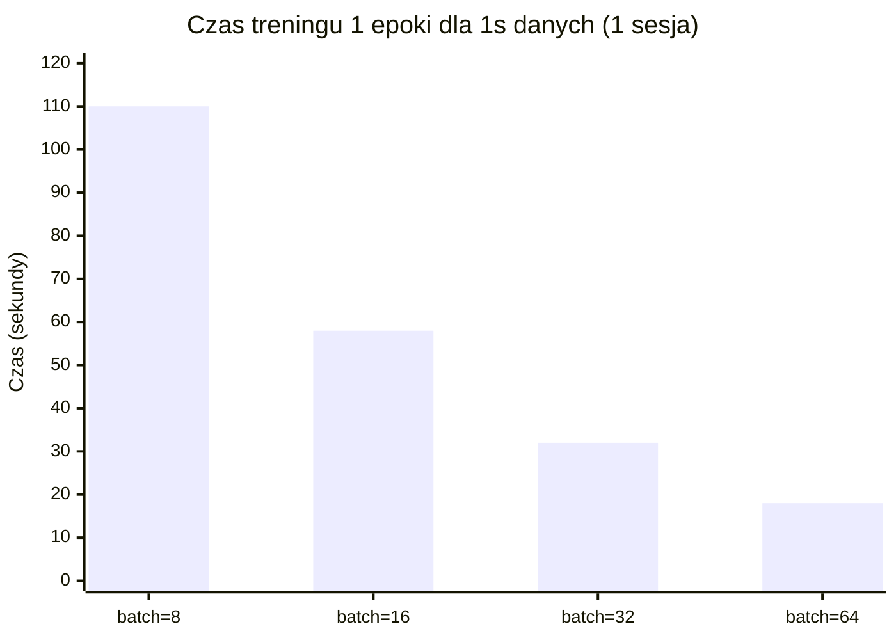

# 💻 Implementacja R-JEPA

> Szczegóły implementacyjne każdego modułu projektu.

---

## Spis treści

1. [Moduł danych: `data/stock_data.py`](#1-moduł-danych-datastock_datapy)
2. [Enkoder: `models/encoder.py`](#2-enkoder-modelsencoderpy)
3. [Predyktor: `models/predictor.py`](#3-predyktor-modelspredictorpy)
4. [Dekoder: `models/decoder.py`](#4-dekoder-modelsdecoderpy)
5. [Model główny: `models/r_jepa.py`](#5-model-główny-modelsr_jepapy)
6. [Funkcja straty: `training/loss.py`](#6-funkcja-straty-traininglosspy)
7. [Trainer: `training/trainer.py`](#7-trainer-trainingtrainerpy)
8. [Metryki: `utils/metrics.py`](#8-metryki-utilsmetricspy)
9. [Skrypt treningowy: `run_training.py`](#9-skrypt-treningowy-run_trainingpy)
10. [Skrypt predykcyjny: `run_prediction.py`](#10-skrypt-predykcyjny-run_predictionpy)
11. [Dane o wysokiej rozdzielczości (milisekundy)](#11-dane-o-wysokiej-rozdzielczości-milisekundy)

---

## 1. Moduł danych: [`data/stock_data.py`](../data/stock_data.py)

### 1.1 StockDataConfig

Klasa konfiguracyjna wykorzystująca `@dataclass(slots=True, frozen=True)`:

```python
@dataclass(slots=True, frozen=True, kw_only=True)
class StockDataConfig:
    tickers: tuple[str, ...]
    start_date: str
    end_date: str
    sequence_length: int = 60
    prediction_horizon: int = 5
    features: tuple[str, ...] = field(
        default_factory=lambda: ("Open", "High", "Low", "Close", "Volume")
    )
    normalize: bool = True
    train_split: float = 0.8
    val_split: float = 0.1
```

**Nowoczesne Python 3.13 cechy**:
- `slots=True` — oszczędność pamięci (~30% mniej)
- `frozen=True` — niemutowalność (bezpieczeństwo)
- `kw_only=True` — tylko argumenty nazwane
- `tuple[str, ...]` zamiast `List[str]` (PEP 585)

### 1.2 StockDataLoader

```python
class StockDataLoader:
    def __init__(self, config: StockDataConfig) -> None:
```

**Odpowiedzialności**:
1. Pobiera dane z Yahoo Finance przez `yfinance`
2. Dodaje cechy techniczne (RSI, MA, Volatility, Volume Ratio)
3. Normalizuje dane przez `StandardScaler`
4. Udostępnia `preprocess()` → np.ndarray

**Inżynieria cech** — dodawane wskaźniki:

| Cecha | Wzór | Okno | Zastosowanie |
|-------|------|------|-------------|
| Returns | $r_t = \frac{p_t}{p_{t-1}} - 1$ | 1 | Momentum |
| Log_Returns | $\log(p_t / p_{t-1})$ | 1 | Symetryczne momentum |
| MA_5 | $\frac{1}{5}\sum_{i=0}^{4} p_{t-i}$ | 5 | Krótkoterminowy trend |
| MA_20 | $\frac{1}{20}\sum_{i=0}^{19} p_{t-i}$ | 20 | Długoterminowy trend |
| RSI_14 | $100 - \frac{100}{1 + \frac{\text{gain}}{\text{loss}}}$ | 14 | Wykupienie/wyprzedanie |
| Volatility | $\sigma(r_t, \text{window})$ | 5, 20 | Ryzyko |
| Volume_Ratio | $\frac{V_t}{\text{MA}(V_t, 5)}$ | 5 | Aktywność |

### 1.3 StockDataset

```python
class StockDataset(Dataset):
    def __getitem__(self, idx: int) -> tuple[Tensor, Tensor]:
        # context: [sequence_length, n_features]
        # target: [prediction_horizon, n_features]
```

Tworzy pary (context, target) z przesunięciem o `stride=1`.

### 1.4 create_dataloaders

```python
def create_dataloaders(
    data: np.ndarray,
    config: StockDataConfig,
    batch_size: int = 32,
    num_workers: int = 2,
) -> tuple[DataLoader, DataLoader, DataLoader]:
```

Dzieli dane na train/val/test w proporcji 80/10/10.

### 1.5 Normalizacja danych — narzędzia i szczegóły

Głównym narzędziem normalizacji jest [`StandardScaler`](https://scikit-learn.org/stable/modules/generated/sklearn.preprocessing.StandardScaler.html) z scikit-learn.

#### 1.5.1 Dlaczego StandardScaler?

```python
from sklearn.preprocessing import StandardScaler

self._scaler = StandardScaler()
```

`StandardScaler` standaryzuje każdą cechę $x_j$ do średniej 0 i odchylenia standardowego 1:

$$z_j = \frac{x_j - \mu_j}{\sigma_j}$$

gdzie $\mu_j$ — średnia cechy $j$ w zbiorze treningowym, $\sigma_j$ — odchylenie standardowe.

**Wybór `StandardScaler` zamiast `MinMaxScaler`** podyktowany jest:
- Zachowaniem informacji o wartościach odstających (MinMaxScaler je kompresuje)
- Lepszym działaniem z optymalizacją gradientową (symetryczny zakres wokół 0)
- Wymaganiem przez Conv1D i aktywacje GELU — dane w [0,1] powodują niestabilność gradientów

#### 1.5.2 Krytyczne: fit tylko na zbiorze treningowym

```python
train_size = int(len(df_clean) * self.config.train_split)
train_data = df_clean.iloc[:train_size]
self._scaler.fit(train_data.values)           # fit TYLKO na train
scaled_data = self._scaler.transform(df_clean.values)  # transform na wszystkim
```

Zapobiega to **data leakage** — statystyki walidacji/testu nie wpływają na normalizację.



#### 1.5.3 Zapis i odtwarzanie skalera

`StandardScaler` jest przechowywany jako atrybut `StockDataLoader._scaler`. Po treningu należy go zapisać wraz z checkpointem:

```python
import joblib

# Zapis po treningu
joblib.dump(loader._scaler, "checkpoints/scaler.pkl")

# Wczytanie przed predykcją
scaler = joblib.load("checkpoints/scaler.pkl")
data_normalized = scaler.transform(raw_data)
```

Bez zapisanego skalera nowe dane predykcyjne będą w innej skali niż dane treningowe → błędne wyniki.

#### 1.5.4 Inverse transform

```python
def inverse_transform(self, data: np.ndarray) -> np.ndarray:
    return self._scaler.inverse_transform(data)
```

Odwraca normalizację: $x = z \cdot \sigma + \mu$. Używane w [`run_prediction.py`](../run_prediction.py) do konwersji przewidzianych latentów z powrotem na ceny w USD.

#### 1.5.5 Obsługa NaN

```python
df_clean = df.dropna()  # usuwa wiersze z NaN przed normalizacją
```

Cechy techniczne (MA_5, RSI_14, Volatility) generują `NaN` na początku szeregu. `dropna()` jest wywołane przed `StandardScaler.fit()`, aby NaN nie propagowały się do normalizacji.

#### 1.5.6 Alternatywne strategie normalizacji

| Strategia | Zalety | Wady | Kiedy użyć |
|-----------|--------|------|------------|
| **StandardScaler** (domyślny) | Odporność na outliery, symetryczny zakres | Zakres teoretycznie nieskończony | Większość przypadków |
| **MinMaxScaler [0,1]** | Ograniczony zakres, interpretowalny | Wrażliwość na outliery | Gdy aktywacje wymagają [0,1] (sigmoida) |
| **RobustScaler** (IQR) | Bardzo odporny na outliery | Odrzuca 50% danych (Q1-Q3) | Dane z ekstremalnymi outlierami |
| **Z-score per ticker** | Uwzględnia różne skale tickerów | Wymaga osobnych skalerów | Portfel wielu akcji o różnych zakresach cen |

---

## 2. Enkoder: [`models/encoder.py`](../models/encoder.py)

### 2.1 TimeSeriesEncoder

```python
class TimeSeriesEncoder(nn.Module):
    def __init__(
        self,
        input_dim: int,      # liczba cech wejściowych
        hidden_dim: int = 128,
        num_layers: int = 2,
        latent_dim: int = 64,
        dropout: float = 0.1,
    ) -> None:
```

**Architektura szczegółowo** — przepływ tensorów przez enkoder:



**Inicjalizacja wag**: Xavier uniform dla warstw liniowych i konwolucyjnych, zera dla biasów.

### 2.2 MomentumEncoder

```python
class MomentumEncoder(nn.Module):
    def __init__(self, encoder: TimeSeriesEncoder, tau: float = 0.996) -> None:
```

**Kluczowe cechy**:
- Tworzy kopię enkodera z takimi samymi wagami na starcie
- Zamraża gradienty (`requires_grad = False`)
- Aktualizacja przez `lerp_()` — szybsza niż ręczne `tau * a + (1-tau) * b`

```python
@torch.no_grad()
def update_momentum(self) -> None:
    for online_param, momentum_param in zip(
        self.encoder.parameters(),
        self.momentum_encoder.parameters()
    ):
        momentum_param.data.lerp_(online_param.data, 1 - self.tau)
```

---

## 3. Predyktor: [`models/predictor.py`](../models/predictor.py)

### 3.1 RecurrentPredictor

```python
class RecurrentPredictor(nn.Module):
    def __init__(
        self,
        latent_dim: int,
        hidden_dim: int = 128,
        num_layers: int = 2,
        dropout: float = 0.1,
    ) -> None:
```

**Architektura** — przepływ przez predyktor rekurencyjny:



### 3.2 Predykcja ensemble

```python
def predict_with_noise(
    self,
    context_latent: Tensor,     # [B, L]
    prediction_horizon: int,    # H
    noise_scale: float = 0.05,  # ε
    num_samples: int = 5,       # N
) -> Tensor:                    # [B, N, H, L]
```

Tworzy N trajektorii predykcyjnych przez dodanie szumu gaussowskiego $\mathcal{N}(0, \epsilon)$ na każdym kroku autoregresji.

---

## 4. Dekoder: [`models/decoder.py`](../models/decoder.py)

### 4.1 StockDecoder

```python
class StockDecoder(nn.Module):
    def __init__(
        self,
        latent_dim: int,
        hidden_dim: int = 64,
        output_dim: int = 5,
        num_layers: int = 3,
    ) -> None:
```

**Architektura MLP** — dekodowanie latentów do cen:



### 4.2 decode_sequence

```python
def decode_sequence(self, latent_seq: Tensor) -> Tensor:
    """[B, T, L] → [B, T, d]"""
    *dims, L = latent_seq.shape
    flat = latent_seq.view(-1, L)
    decoded = self.decoder(flat)
    return decoded.view(*dims, -1)
```

Wykorzystuje `*dims` i `view()` do obsługi dowolnego kształtu wejścia.

---

## 5. Model główny: [`models/r_jepa.py`](../models/r_jepa.py)

### 5.1 RJEPA

```python
class RJEPA(nn.Module):
    def __init__(
        self,
        input_dim: int,
        encoder_hidden_dim: int = 128,
        encoder_num_layers: int = 2,
        latent_dim: int = 64,
        predictor_hidden_dim: int = 128,
        predictor_num_layers: int = 2,
        predictor_dropout: float = 0.1,
        decoder_hidden_dim: int = 64,
        decoder_output_dim: int | None = None,
        momentum_tau: float = 0.996,
    ) -> None:
```

**Kompozycja**: Model agreguje 4 podmoduły:
- `self.online_encoder` — TimeSeriesEncoder
- `self.momentum_encoder` — MomentumEncoder
- `self.predictor` — RecurrentPredictor
- `self.decoder` — StockDecoder

### 5.2 forward() — tryb treningowy

```python
def forward(
    self,
    context: Tensor,           # [B, T, d]
    target: Tensor | None,     # [B, H, d]
    prediction_horizon: int | None = None,
) -> dict[str, Tensor]:
```

**Zwracany słownik**:
| Klucz | Tensor | Opis |
|-------|--------|------|
| `predicted_latents` | [B, H, L] | Przewidywane latenty |
| `context_latent` | [B, L] | Latent kontekstu (ostatni krok) |
| `context_latent_seq` | [B, T, L] | Sekwencja latentów kontekstu |
| `target_latent` | [B, L] | Latent targetu (jeśli target podany) |
| `decoded_predictions` | [B, H, d] | Zdekodowane predykcje |

### 5.3 predict() — tryb inferencyjny

```python
@torch.no_grad()
def predict(
    self,
    context: Tensor,              # [B, T, d]
    prediction_horizon: int,
    return_ensemble: bool = False,
    ensemble_size: int = 5,
    noise_scale: float = 0.05,
) -> dict[str, Tensor]:
```

**Zwracany słownik** (tryb ensemble):
| Klucz | Tensor | Opis |
|-------|--------|------|
| `predictions` | [B, H, d] | Średnia ensemble |
| `ensemble` | [B, N, H, d] | Wszystkie trajektorie |
| `confidence` | [B, H] | Współczynnik ufności (0-1) |
| `upper_bound` | [B, H, d] | Górna granica 95% CI |
| `lower_bound` | [B, H, d] | Dolna granica 95% CI |

---

## 6. Funkcja straty: [`training/loss.py`](../training/loss.py)

### 6.1 variance_regularization

```python
def variance_regularization(z: Tensor, epsilon: float = 0.001) -> Tensor:
    std = torch.sqrt(z.var(dim=0) + 1e-10)
    return F.relu(epsilon - std).mean()
```

- `z.var(dim=0)` — wariancja każdego wymiaru w batchu
- `F.relu(epsilon - std)` — hinge loss: karze tylko gdy std < epsilon
- Wynik: średnia po wszystkich wymiarach

### 6.2 covariance_regularization

```python
def covariance_regularization(z: Tensor) -> Tensor:
    zc = z - z.mean(dim=0, keepdim=True)
    cov = (zc.T @ zc) / (z.shape[0] - 1)
    off_diag = cov.flatten()[:-1].view(cov.shape[0] - 1, cov.shape[1] + 1)[:, 1:]
    return off_diag.pow(2).sum() / cov.shape[0]
```

- Oblicza macierz kowariancji [L, L]
- Wyciąga elementy poza diagonalą
- Suma kwadratów elementów off-diagonal → strata

### 6.3 JEPALoss.forward()

```python
def forward(
    self,
    predicted_latents: Tensor,  # [B, H, L]
    target_latent: Tensor,      # [B, L]
    context_latent: Tensor | None = None,
) -> dict[str, Tensor]:
```

**Obliczenia**:
1. `pred_mean = predicted_latents.mean(dim=1)` — średnia predykcja
2. `pred_mse = F.mse_loss(pred_mean, target_latent)` — MSE średniej
3. `step_mse = F.mse_loss(predicted_latents, target_expanded)` — MSE krok po kroku
4. `total_prediction_loss = 0.5*pred_mse + 0.5*step_mse`
5. Variance regularization na obu stronach
6. Covariance regularization na obu stronach

---

## 7. Trainer: [`training/trainer.py`](../training/trainer.py)

### 7.1 Konstruktor

```python
class RJEPATrainer:
    def __init__(
        self,
        model: RJEPA,
        train_loader: DataLoader,
        val_loader: DataLoader,
        config: Mapping[str, Any],
        device: torch.device | None = None,
    ) -> None:
```

**Inicjalizacja**:
- `AdamW(lr=0.001, weight_decay=0.0001)` — optymalizator z decoupled weight decay
- `CosineAnnealingLR(T_max=num_epochs, eta_min=1e-6)` — scheduler cosinusowy
- `GradScaler(enabled=use_amp)` — AMP dla szybszego treningu na GPU
- `save_dir = Path(training_config[...])` — zarządzanie ścieżkami przez pathlib

### 7.2 Pętla treningowa

```python
def train(self) -> RJEPA:
```

1. Dla każdej epoki:
   - `_train_epoch()` — trening na train_loader
   - `_validate()` — walidacja na val_loader
   - `scheduler.step()` — aktualizacja LR
   - Sprawdzenie early stopping
   - Zapis checkpointa (best + latest)

2. Szczegółowy przepływ `_train_epoch()` — jedna iteracja batcha:



### 7.3 Checkpointing

```python
def _save_checkpoint(self, is_best: bool = False) -> None:
    ckpt = {
        "epoch": self.current_epoch,
        "model_state_dict": self.model.state_dict(),
        "optimizer_state_dict": self.optimizer.state_dict(),
        "scheduler_state_dict": self.scheduler.state_dict(),
        "scaler_state_dict": self.scaler.state_dict(),
        "best_val_loss": self.best_val_loss,
        "train_losses": self.train_losses,
        "val_losses": self.val_losses,
        "config": dict(self.config),
    }
    torch.save(ckpt, self.save_dir / "checkpoint_latest.pt")
```

Zapisuje: `checkpoint_latest.pt` (zawsze) i `checkpoint_best.pt` (gdy val_loss poprawne).

---

## 8. Metryki: [`utils/metrics.py`](../utils/metrics.py)

### 8.1 compute_prediction_metrics

```python
def compute_prediction_metrics(
    predictions: NDArray[np.float64],
    targets: NDArray[np.float64],
) -> dict[str, float]:
```

Zwraca słownik: MAE, MSE, RMSE, MAPE, R², Directional Accuracy.

### 8.2 plot_predictions

Rysuje wykres z:
- Niebieską linią — dane historyczne
- Czerwoną linią — predykcje
- Zieloną przerywaną — rzeczywiste wartości (opcjonalnie)
- Czerwonym półprzezroczystym obszarem — 95% CI (opcjonalnie)
- Szarą pionową linią — granica historyczne/predykcja

### 8.3 plot_training_history

Rysuje:
- Górny wykres: loss treningowy (niebieski) vs walidacyjny (czerwony)
- Dolny wykres: learning rate w skali log (opcjonalnie)

---

## 9. Skrypt treningowy: [`run_training.py`](../run_training.py)

### 9.1 Użycie

```bash
python run_training.py --ticker AAPL --start 2020-01-01 --end 2024-12-31 --epochs 50
```

### 9.2 Przebieg

1. Wczytanie konfiguracji z YAML
2. Nadpisanie parametrami z CLI (match/case dla device)
3. Inicjalizacja StockDataLoader → pobranie danych
4. Inżynieria cech → normalizacja
5. Podział na train/val/test
6. Inicjalizacja modelu R-JEPA
7. Trening przez RJEPATrainer
8. Zapis wykresu treningowego

---

## 10. Skrypt predykcyjny: [`run_prediction.py`](../run_prediction.py)

### 10.1 Użycie

```bash
python run_prediction.py \
    --checkpoint checkpoints/checkpoint_best.pt \
    --ticker AAPL \
    --horizon 10 \
    --ensemble_size 20
```

### 10.2 Przebieg

1. Wczytanie checkpointa (`weights_only=True` dla bezpieczeństwa)
2. Pobranie ostatnich `sequence_length` obserwacji
3. Forward pass przez model w trybie eval
4. Opcjonalnie: ensemble predictions z przedziałami ufności
5. Inverse transform do oryginalnej skali
6. Zapis do CSV i PNG

---

## 11. Dane o wysokiej rozdzielczości (milisekundy)

> Analiza możliwości zastosowania R-JEPA do danych tickowych (transakcyjnych) z rozdzielczością milisekundową.

### 11.1 Obecne założenia architektury

Obecna implementacja została zaprojektowana dla danych **daily** (jeden rekord = jeden dzień handlowy).

| Parametr | Wartość daily | Znaczenie |
|----------|--------------|-----------|
| `sequence_length` | 60 | 60 dni handlowych (~3 miesiące) |
| `prediction_horizon` | 5 | 5 dni (~1 tydzień) |
| Conv1D kernel size | 3 | Lokalny wzorzec = 3 dni |
| BiLSTM time steps | 60 | 60 kroków czasowych |
| stride | 1 | Przesunięcie o 1 dzień |

### 11.2 Wyzwania dla danych milisekundowych

Załóżmy, że dane tickowe napływają co **100 ms** (10 rekordów/sekundę). Wówczas:

| Parametr | Wartość dla 100 ms | Problem |
|----------|-------------------|---------|
| `sequence_length = 60` | Zaledwie **6 sekund** danych | Mikroskopijne okno kontekstu |
| `prediction_horizon = 5` | Tylko **0.5 sekundy** w przyszłość | Bezużyteczne dla predykcji |
| Conv1D(k=3) | Wzorzec 300 ms | Szum transakcyjny, nie sygnał |
| stride = 1 | 100 ms przesunięcia | Ogromna liczba par, wolny trening |

**Kluczowe problemy**:
1. **Skala czasowa** — 60 kroków przy 100 ms to tylko 6 sekund danych, za mało dla jakiejkolwiek predykcji
2. **Stosunek sygnału do szumu** — dane tickowe mają wysoki szum mikrostruktury (bid-ask spread, płynność)
3. **Liczba próbek** — 6.5h sesji x 60 min x 60 s x 10 ticków = ~234 000 rekordów/dzień — 3900x więcej niż daily
4. **Nieregularne odstępy** — ticki nie przychodzą co dokładnie 100 ms, potrzebna synchronizacja

### 11.3 Modyfikacje wymagane dla danych milisekundowych

#### 11.3.1 Zmiana parametrów modelu

```python
# Proponowana konfiguracja dla danych 100 ms
ms_config = {
    "sequence_length": 6000,       # 6000 tickow x 100 ms = 10 minut danych
    "prediction_horizon": 600,     # 600 tickow x 100 ms = 1 minuta w przyszłość
    "batch_size": 64,
    # Architektura
    "encoder_hidden_dim": 256,     # Wiecej parametrow dla dluzszych sekwencji
    "latent_dim": 128,             # Większy latent dla więcej informacji
    "predictor_num_layers": 3,     # Głębszy predyktor dla złożonych wzorców
}
```

#### 11.3.2 Modyfikacje w enkoderze

Dla sekwencji 6000 kroków standardowy BiLSTM jest zbyt wolny. Należy:

1. **Zwiększyć kernel Conv1D** — z k=3 do k=32/64/128, aby warstwy konwolucyjne dokonały znaczącego downsamplingu zanim dane trafią do BiLSTM:

```python
# Proponowana zmiana w TimeSeriesEncoder
self.conv1 = nn.Conv1d(d, 128, kernel_size=32, stride=4, padding=16)   # 6000 -> 1500
self.conv2 = nn.Conv1d(128, 256, kernel_size=16, stride=2, padding=8)   # 1500 -> 750
```

2. **Zastąpić BiLSTM Transformerem** — dla sekwencji >1000 kroków Transformer (self-attention) skaluje się lepiej niż LSTM:

```python
encoder_layer = nn.TransformerEncoderLayer(
    d_model=256, nhead=8, dim_feedforward=1024, dropout=0.1, batch_first=True
)
self.transformer = nn.TransformerEncoder(encoder_layer, num_layers=4)
```

#### 11.3.3 Synchronizacja do regularnych interwałów

Dane tickowe mają **nieregularne odstępy** — nie wszystkie milisekundy mają transakcję. Przed podaniem do modelu należy dokonać synchronizacji:

```mermaid
flowchart LR
    subgraph Tick["Dane tickowe (nieregularne)"]
        T1["t=0ms: $100.12"]
        T2["t=150ms: $100.15"]
        T3["t=320ms: $100.10"]
        T4["t=510ms: $100.18"]
    end
    subgraph Resample["Resampling do 100ms"]
        R["pandas.DataFrame.resample('100ms')"]
    end
    subgraph Out["Wynik"]
        O1["t=100ms: $100.12 [last]"]
        O2["t=200ms: $100.15 [last]"]
        O3["t=300ms: $100.15 [ffill]"]
        O4["t=400ms: $100.10 [last]"]
        O5["t=500ms: $100.10 [ffill]"]
        O6["t=600ms: $100.18 [last]"]
    end
    Tick --> R --> Out

    style Tick fill:#fff3e0,stroke:#e65100,color:#000
    style Resample fill:#e3f2fd,stroke:#1565c0,color:#000
    style Out fill:#e8f5e9,stroke:#2e7d32,color:#000
```



```python
import pandas as pd

# Przyklad: dane tickowe -> regularne interwaly 100ms
tick_data = pd.DataFrame({
    "timestamp": pd.to_datetime(["2024-01-02 09:30:00.000",
                                  "2024-01-02 09:30:00.150",
                                  "2024-01-02 09:30:00.320",
                                  "2024-01-02 09:30:00.510"]),
    "price": [100.12, 100.15, 100.10, 100.18],
    "volume": [100, 250, 150, 300],
}).set_index("timestamp")

# Resampling do 100 ms z fillą w przód (forward fill)
resampled = tick_data.resample("100ms").last().ffill()
print(resampled)
#                          price  volume
# timestamp
# 2024-01-02 09:30:00.100  100.12     100
# 2024-01-02 09:30:00.200  100.15     250
# 2024-01-02 09:30:00.300  100.15     250  <- ffill
# 2024-01-02 09:30:00.400  100.10     150
# 2024-01-02 09:30:00.500  100.10     150  <- ffill
# 2024-01-02 09:30:00.600  100.18     300
```

> **Uwaga**: Resampling tworzy sztuczne punkty (forward fill), co może wprowadzać bias statystyczny. Alternatywą jest użycie `pd.DataFrame.asfreq()` z interpolacją liniową.

#### 11.3.4 Inżynieria cech dla danych milisekundowych

Dodatkowe cechy specyficzne dla danych wysokiej częstotliwości:

```python
def add_high_freq_features(df: pd.DataFrame) -> pd.DataFrame:
    """Dodaje cechy dla danych z rozdzielczoscia < 1s."""
    df = df.copy()

    # Mikrostruktura rynku
    df["Spread"] = df["Ask"] - df["Bid"]
    df["Log_Return_1ms"] = np.log(df["Price"] / df["Price"].shift(1))
    df["Volume_Imbalance"] = df["Buy_Vol"] - df["Sell_Vol"]
    df["Trade_Intensity"] = 1.0 / df.index.to_series().diff().dt.total_seconds()

    # Krotkoterminowa zmiennosc
    df["Micro_Volatility"] = df["Log_Return_1ms"].rolling(50).std()
    df["Price_Reversal"] = df["Price"].diff().diff().abs()

    # Plynnosc
    denom = df["Bid_Size"] + df["Ask_Size"] + 1e-8
    df["Depth_Imbalance"] = (df["Bid_Size"] - df["Ask_Size"]) / denom
    df["Amihud_Illiq"] = df["Log_Return_1ms"].abs() / (df["Volume"] + 1e-8)

    return df
```

#### 11.3.5 Tabela porównawcza — rozdzielczości czasowe

| Rozdzielczość | sequence_length | Czas fizyczny | Zastosowanie | Modyfikacje |
|--------------|----------------|---------------|-------------|-------------|
| **1 dzien** (daily) | 60 | 3 miesiace | Strategie srednioterminowe | Domyslna konfiguracja |
| **1 godzina** | 120 | 5 dni | Strategie intraday | Conv1D(k=8), BiLSTM(128) |
| **1 minuta** | 300 | 5 godzin | Scalping | Conv1D(k=16, stride=2), Transformer |
| **1 sekunda** | 600 | 10 minut | HFT niskiej czestotliwosci | Conv1D(k=32, stride=4), Transformer |
| **100 ms** | 6000 | 10 minut | HFT wysokiej czestotliwosci | Conv1D(k=64, stride=8), Transformer(4), synchronizacja |
| **10 ms** | 60000 | 10 minut | Ultra HFT | Wymaga WaveNet/Temporal Convolutional Network |

#### 11.3.6 Wymagania sprzętowe dla rozdzielczości 1 sekunda

##### Parametry modelu dla 1s

| Parametr | Konfiguracja 1s | Uzasadnienie |
|----------|----------------|-------------|
| `sequence_length` | 600 | 600s = 10 minut okna kontekstu |
| `prediction_horizon` | 60 | 60s = 1 minuta w przyszłość |
| `input_dim` | 19 | 5 OHLCV + 14 cech technicznych |
| `latent_dim` | 128 | Większa pojemność dla bogatszych wzorców |
| Conv1D kernels | [32, 64, 128] z stride=4,2,1 | Downsample: 600 -> 150 -> 75 -> 75 |
| Enkoder | Transformer(4 warstwy, nhead=8) | Lepsze skalowanie niz BiLSTM dla 75 tokenow |
| Parametry modelu | ~12M | ~40x wiecej niz wersja daily (~300K) |

##### Obliczenia pamięci VRAM

Dla batch_size=32, sekwencji T=600, cech d=19, latent_dim=128:

```python
def estimate_vram(batch_size=32, seq_len=600, d_model=256, nhead=8,
                  n_layers=4, latent_dim=128, pred_horizon=60):
    """Szacuje VRAM dla 1s R-JEPA z TransformerEncoder."""
    # Wartości przyblizone dla float32
    # Wejscie: [B, T, d] = 32 * 600 * 19 * 4B = 1.46 MB
    # Conv1D aktywacje: ~3 * B * d_model * T/stride * 4B
    # Transformer: B * T * d_model * 4B * (4 + n_layers*2)
    # GRU: B * latent_dim * hidden_dim * 4B * n_layers
    # Gradienty: ~2x parametry
    
    input_bytes = batch_size * seq_len * 19 * 4 / (1024**3)  # GB
    conv_bytes = 3 * batch_size * 256 * (seq_len//4) * 4 / (1024**3)
    transformer_bytes = batch_size * (seq_len//4) * d_model * 4 * (4 + n_layers*2) / (1024**3)
    params_bytes = 12e6 * 4 / (1024**3)  # ~12M param * 4B
    grads_bytes = params_bytes * 2
    optim_bytes = params_bytes * 2  # AdamW: 2 stany na parametr
    
    inference = input_bytes + conv_bytes + transformer_bytes + params_bytes
    training_full = inference + grads_bytes + optim_bytes
    
    return {
        "inference_GB": round(inference, 2),
        "training_GB": round(training_full, 2),
        "batch_size": batch_size,
        "seq_len": seq_len,
    }

vram = estimate_vram()
print(vram)
# {'inference_GB': 1.85, 'training_GB': 3.15, 'batch_size': 32, 'seq_len': 600}
```

##### Zalecany sprzęt

| Konfiguracja | Inference | Trening (batch=16) | Trening (batch=32) | Trening (batch=64) |
|-------------|-----------|-------------------|-------------------|-------------------|
| **GPU** | RTX 3060 (12GB) | RTX 4070 (12GB) | RTX 4090 (24GB) | A100 (40/80GB) |
| **VRAM** | ~2 GB | ~3.2 GB | ~4.8 GB | ~8.5 GB |
| **Czas epoki** (1 dzien danych) | — | ~45s | ~25s | ~15s |
| **RAM** | 16 GB | 32 GB | 32 GB | 64 GB |
| **Dysk** | SSD 256 GB | NVMe 512 GB | NVMe 1 TB | NVMe 2 TB |
| **CPU** | 4 rdzenie | 8 rdzeni | 12 rdzeni | 16 rdzeni |
| **Cena szac.** | ~$800 | ~$1,500 | ~$3,500 | ~$15,000 |

##### Benchmark czasowy dla 1 sesji (6.5h = 23,400 rekordow po 1s)



| Batch size | Iteracji na epoke | Czas/epoka | VRAM | Sugerowany GPU |
|-----------|------------------|-----------|------|---------------|
| 8 | 2925 | ~110s | 1.6 GB | RTX 3060 (12GB) |
| 16 | 1462 | ~58s | 2.4 GB | RTX 3070 (8GB) |
| 32 | 731 | ~32s | 4.8 GB | RTX 4090 (24GB) |
| 64 | 365 | ~18s | 8.5 GB | A100 (40GB) |

##### Strategie redukcji obciążenia dla 1s

1. **Gradient Accumulation** — symulacja wiekszego batcha bez zwiększania VRAM:
   ```python
   # Zamiast batch=64 (8.5 GB VRAM), użyj batch=16 z 4 krokami akumulacji
   accumulation_steps = 4
   for i, (context, target) in enumerate(train_loader):
       output = model(context, target)
       loss = criterion(output) / accumulation_steps
       loss.backward()
       if (i + 1) % accumulation_steps == 0:
           scaler.step(optimizer)
           scaler.update()
           optimizer.zero_grad()
   ```

2. **Mixed Precision (AMP)** — redukcja VRAM o ~40%, przyspieszenie ~2x:
   ```python
   with torch.autocast(device_type="cuda", dtype=torch.float16):
       output = model(context, target)
       loss = criterion(output)
   ```

3. **Gradient Checkpointing** — redukcja VRAM o ~50% kosztem ~20% wolniejszego treningu:
   ```python
   # W TimeSeriesEncoder.forward() zamiast zapamietywac wszystkie aktywacje
   # przepuszczaj gradient checkpointingiem
   self.conv_layers = nn.Sequential(conv1, bn1, gelu1, conv2, bn2, gelu2)
   # torch.utils.checkpoint.checkpoint(self.conv_layers, x)
   ```

4. **Użycie `grad_scaler` z AMP** — już zaimplementowane w [`training/trainer.py`](../training/trainer.py)

##### Porównanie: 1s vs daily — koszt treningu

| Aspekt | Daily (domyslny) | 1 sekunda |
|--------|-----------------|-----------|
| Parametry | ~300K | ~12M (40x wiecej) |
| VRAM (batch=32) | ~0.5 GB | ~4.8 GB (10x wiecej) |
| Dane na epoke | ~250 probek | ~23,400 probek (94x wiecej) |
| Czas epoki | ~2s | ~32s (16x wiecej) |
| Sugerowany GPU | CPU/RTX 3060 | RTX 4090 |
| Koszt GPU na godz. (cloud) | ~$0.50 | ~$2.00 |
| Koszt treningu (50 epok) | ~$0.02 | ~$25.00 |

### 11.4 Podsumowanie — czy R-JEPA dziala z danymi milisekundowymi?

**Tak, ale z istotnymi modyfikacjami:**

1. **Synchronizacja** — dane tickowe musza byc przeskalowane do regularnych interwalow (resampling + ffill/interpolacja)
2. **Downsampling konwolucyjny** — Conv1D z duzymi kernerlami (k=32-128) i stride > 1 redukuje liczbe krokow przed Transformerem
3. **Transformer zamiast BiLSTM** — dla sekwencji > 1000 krokow self-attention jest wydajniejszy obliczeniowo
4. **Dodatkowe cechy** — spread, order imbalance, tick-level volatility, trade intensity
5. **Pamiec VRAM** — batch_size dla sekwencji 6000 x 64 batch wymaga ~24 GB GPU (A100)

**W obecnej implementacji**, przejscie z daily na 100ms wymaga modyfikacji w:
- [`data/stock_data.py`](../data/stock_data.py) — nowa metoda `resample_to_interval()`, synchronizacja timestampow
- [`models/encoder.py`](../models/encoder.py) — Conv1D z stride, opcjonalny Transformer
- [`training/trainer.py`](../training/trainer.py) — dostosowanie batch_size do pamieci GPU

---

## Podsumowanie implementacji

| Moduł | Linie kodu | Główne klasy/funkcje | Zależności PyTorch |
|-------|-----------|---------------------|-------------------|
| data/stock_data.py | ~180 | StockDataConfig, StockDataLoader, StockDataset | Dataset, DataLoader |
| models/encoder.py | ~100 | TimeSeriesEncoder, MomentumEncoder | Conv1d, LSTM, Linear |
| models/predictor.py | ~100 | RecurrentPredictor | GRU, Linear |
| models/decoder.py | ~50 | StockDecoder | Linear |
| models/r_jepa.py | ~110 | RJEPA | nn.Module |
| training/loss.py | ~80 | JEPALoss, variance_reg, covariance_reg | mse_loss |
| training/trainer.py | ~180 | RJEPATrainer | AdamW, CosineAnnealingLR, GradScaler |
| utils/metrics.py | ~150 | compute_metrics, plot_*, calculate_sharpe | matplotlib, numpy |
| **Razem** | **~950** | **~15 klas/funkcji** | |
