# 📘 Dokumentacja R-JEPA Stock Prediction

> **R**ecurrent **J**oint **E**mbedding **P**redictive **A**rchitecture — predykcja kursów akcji z wykorzystaniem samonadzorowanego uczenia reprezentacji.

---

## Spis treści

| Sekcja | Opis |
|--------|------|
| [📐 Model matematyczny](model_matematyczny.md) | Szczegółowy opis matematyczny modelu R-JEPA, funkcji straty JEPA, enkodera, predyktora i dekodera |
| [🏗️ Architektura](architektura.md) | Diagramy architektury, przepływ danych, komponenty systemu |
| [💻 Implementacja](implementacja.md) | Szczegóły implementacyjne każdego modułu: dane, modele, trening, wnioskowanie |
| [🎯 Proces uczenia](proces_uczenia.md) | Szczegółowy przebieg treningu: forward pass, loss, backward, EMA, checkpointing |
| [🚀 Instrukcja uruchomienia](instrukcja_uruchomienia.md) | Krok po kroku: instalacja, konfiguracja, trenowanie, predykcja |

---

## Przegląd projektu

```
jepaagent/
├── 📁 doc/                    ← Jesteś tutaj — dokumentacja
├── 📁 config/                 # Konfiguracja (YAML)
├── 📁 data/                   # Ładowanie i przetwarzanie danych
├── 📁 models/                 # Implementacja modelu R-JEPA
├── 📁 training/               # Pętla treningowa i funkcja straty
├── 📁 utils/                  # Metryki i wizualizacja
├── ▶️  run_training.py        # Skrypt treningowy
└── ▶️  run_prediction.py      # Skrypt predykcyjny
```

### Czym jest R-JEPA?

R-JEPA łączy dwie kluczowe koncepcje:

1. **JEPA (Joint Embedding Predictive Architecture)** — zamiast przewidywać surowe ceny akcji, model uczy się przewidywać abstrakcyjne reprezentacje latentne (`z`) przyszłych stanów rynku. To sprawia, że uczenie jest bardziej efektywne i odporne na szum.

2. **Przetwarzanie rekurencyjne (GRU/LSTM)** — sieci rekurencyjne przechwytują zależności czasowe w dynamice rynkowej.

### Kluczowe koncepcje

| Koncepcja | Opis |
|-----------|------|
| **Samonadzorowane uczenie** | Model uczy się bez etykiet — sam generuje targety z danych |
| **Przestrzeń latentna** | Reprezentacje `z` są przewidywane zamiast surowych cen `x` |
| **Momentum Encoder** | Powoli aktualizowana kopia enkodera zapewniająca stabilne targety |
| **Ensemble** | Wiele trajektorii predykcyjnych z szumem dla estymacji niepewności |
| **Variance-Covariance reg.** | Regularyzacja zapobiegająca collapse'owi reprezentacji |

---

## Szybki start

```bash
# 1. Instalacja
pip install -r requirements.txt

# 2. Trenowanie modelu (domyślnie: AAPL, MSFT, GOOGL)
python run_training.py

# 3. Predykcja
python run_prediction.py --checkpoint checkpoints/checkpoint_best.pt
```

Szczegółowe instrukcje znajdują się w [Instrukcji uruchomienia](instrukcja_uruchomienia.md).

---

## Struktura dokumentacji

```mermaid
graph TD
    A["📘 index.md<br/><small>Strona główna</small>"] --> B["📐 model_matematyczny.md<br/><small>Podstawy teoretyczne</small>"]
    A --> C["🏗️ architektura.md<br/><small>Diagramy i przepływy</small>"]
    A --> D["💻 implementacja.md<br/><small>Szczegóły kodu</small>"]
    A --> G["🎯 proces_uczenia.md<br/><small>Przebieg treningu</small>"]
    A --> H["📊 przyklady.md<br/><small>Przykłady danych i użycia</small>"]
    A --> I["🔧 strojenie.md<br/><small>Strojenie do sprzętu i danych</small>"]
    A --> E["🚀 instrukcja_uruchomienia.md<br/><small>Krok po kroku</small>"]
    
    I --> I1["Profile sprzętowe"]
    I --> I2["Profile danych"]
    I --> I3["Drzewo decyzyjne"]
    I --> I4["Gotowe przepisy YAML"]
    
    D --> D1["data/stock_data.py"]
    D --> D2["models/encoder.py"]
    D --> D3["models/predictor.py"]
    D --> D4["models/r_jepa.py"]
    D --> D5["training/loss.py"]
    D --> D6["training/trainer.py"]
    
    G --> G1["Forward pass"]
    G --> G2["Hybrydowa loss"]
    G --> G3["Backward + EMA"]
    G --> G4["Checkpointing"]
    
    H --> H1["Dane OHLCV"]
    H --> H2["Cechy techniczne"]
    H --> H3["Batch prediction"]
    H --> H4["Export CSV/JSON"]
    
    E --> E1["Konfiguracja"]
    E --> E2["Trenowanie"]
    E --> E3["Predykcja"]
    E --> E4["Wizualizacja"]
```



### Spis dokumentów

| Dokument | Opis |
|----------|------|
| [`index.md`](index.md) | Strona główna dokumentacji |
| [`model_matematyczny.md`](model_matematyczny.md) | Podstawy teoretyczne i wyprowadzenia matematyczne |
| [`architektura.md`](architektura.md) | Diagramy architektury i przepływy danych |
| [`implementacja.md`](implementacja.md) | Szczegóły implementacji każdego modułu |
| [`proces_uczenia.md`](proces_uczenia.md) | Przebieg treningu krok po kroku |
| [`przyklady.md`](przyklady.md) | Przykłady danych treningowych i użycia modelu |
| [`strojenie.md`](strojenie.md) | Strojenie modelu w zależności od posiadanego sprzętu i charakterystyki danych |
| [`instrukcja_uruchomienia.md`](instrukcja_uruchomienia.md) | Instrukcja krok po kroku |

---

> Dokumentacja wygenerowana dla projektu R-JEPA Stock Prediction.
