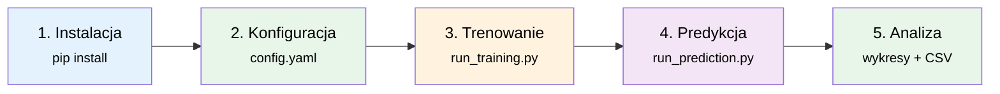

# 🚀 Instrukcja uruchomienia R-JEPA

> Krok po kroku: od instalacji do predykcji kursów akcji.

---

## Spis treści

1. [Wymagania](#1-wymagania)
2. [Instalacja](#2-instalacja)
3. [Konfiguracja](#3-konfiguracja)
4. [Trenowanie modelu](#4-trenowanie-modelu)
5. [Predykcja](#5-predykcja)
6. [Wizualizacja wyników](#6-wizualizacja-wyników)
7. [Zaawansowane opcje](#7-zaawansowane-opcje)
8. [Rozwiązywanie problemów](#8-rozwiązywanie-problemów)

---

## 1. Wymagania

### 1.1 Sprzęt

| Komponent | Minimalny | Zalecany |
|-----------|-----------|----------|
| **CPU** | 4 rdzenie | 8+ rdzeni |
| **RAM** | 8 GB | 16+ GB |
| **GPU** | — | NVIDIA z 8+ GB VRAM |
| **Dysk** | 1 GB wolnego miejsca | 5 GB (dla danych historycznych) |

### 1.2 Oprogramowanie

- **System**: Linux, macOS, Windows (WSL2)
- **Python**: ≥ 3.13 (sprawdź: `python --version`)
- **pip**: ≥ 24.0 (sprawdź: `pip --version`)

### 1.3 Sprawdzenie środowiska

```bash
# Sprawdź wersję Python
python --version
# Oczekiwany wynik: Python 3.13.x

# Sprawdź dostępność GPU (opcjonalnie)
python -c "import torch; print(f'CUDA: {torch.cuda.is_available()}, GPU: {torch.cuda.get_device_name(0) if torch.cuda.is_available() else \"N/A\"}')"
```

---

## 2. Instalacja

### 2.1 Klonowanie repozytorium

```bash
# Przejdź do katalogu projektu
cd /home/jacek/development/jepaagent

# (Opcjonalnie) Utwórz wirtualne środowisko
python -m venv venv
source venv/bin/activate  # Linux/Mac
# lub: venv\Scripts\activate  # Windows
```

### 2.2 Instalacja zależności

```bash
# Podstawowe zależności
pip install -r requirements.txt

# (Opcjonalnie) Dla szybszego treningu na GPU NVIDIA
pip install torch torchvision --index-url https://download.pytorch.org/whl/cu124

# (Opcjonalnie) Dla notebooków Jupyter
pip install jupyter ipykernel
```

### 2.3 Weryfikacja instalacji

```bash
# Test importów
python -c "
import torch
import numpy as np
import pandas as pd
import yfinance as yf
import matplotlib.pyplot as plt
import sklearn
import yaml
from tqdm import tqdm
print('✓ Wszystkie importy działają poprawnie')
print(f'  PyTorch: {torch.__version__}')
print(f'  NumPy: {np.__version__}')
print(f'  pandas: {pd.__version__}')
"
```

---

## 3. Konfiguracja

### 3.1 Plik konfiguracyjny

Edytuj [`config/config.yaml`](../config/config.yaml):

```yaml
data:
  tickers: ["AAPL", "MSFT", "GOOGL"]    # Spółki do analizy
  start_date: "2015-01-01"               # Data początkowa
  end_date: "2024-12-31"                 # Data końcowa
  sequence_length: 60                    # Okno kontekstu (dni)
  prediction_horizon: 5                  # Horyzont predykcji (dni)
  features: ["Open", "High", "Low", "Close", "Volume"]
  train_split: 0.8
  val_split: 0.1

model:
  r_jepa:
    encoder_input_dim: 5
    encoder_hidden_dim: 128
    latent_dim: 64
    predictor_hidden_dim: 128
    predictor_num_layers: 2

training:
  learning_rate: 0.001
  num_epochs: 100
  batch_size: 64
  patience: 10
  save_dir: "./checkpoints"
```

### 3.2 Dostępne tickery

Popularne tickery do testowania:

| Ticker | Spółka | Indeks |
|--------|--------|--------|
| AAPL | Apple Inc. | Nasdaq |
| MSFT | Microsoft Corp. | Nasdaq |
| GOOGL | Alphabet Inc. | Nasdaq |
| AMZN | Amazon.com Inc. | Nasdaq |
| TSLA | Tesla Inc. | Nasdaq |
| ^GSPC | S&P 500 | — |
| ^DJI | Dow Jones | — |

### 3.3 Wybór urządzenia

Automatyczny wybór (domyślnie):
```bash
python run_training.py  # auto: CUDA → CPU
```

Wymuszenie CPU:
```bash
python run_training.py --device cpu
```

Wymuszenie GPU:
```bash
python run_training.py --device cuda
```

---

## 4. Trenowanie modelu

### 4.1 Szybki start (domyślna konfiguracja)

```bash
cd /home/jacek/development/jepaagent
python run_training.py
```

### 4.2 Trenowanie z własnymi parametrami

```bash
# Podstawowe parametry
python run_training.py \
    --ticker AAPL \
    --start 2020-01-01 \
    --end 2024-12-31 \
    --epochs 50

# Pełna konfiguracja
python run_training.py \
    --ticker AAPL \
    --start 2015-01-01 \
    --end 2024-12-31 \
    --epochs 100 \
    --batch_size 32 \
    --lr 0.0005 \
    --seq_len 60 \
    --pred_horizon 10 \
    --latent_dim 128 \
    --save_dir ./checkpoints_aapl \
    --device auto
```

### 4.3 Oczekiwany output

```
============================================================
R-JEPA Stock Prediction — Training
============================================================
  Tickers: ['AAPL']
  Date range: 2020-01-01 → 2023-12-31
  Sequence length: 60
  Prediction horizon: 5
  Latent dim: 64
  Batch size: 64
  Epochs: 50

Step 1: Loading stock data...
Downloading data for AAPL...
  Loaded 1008 rows for AAPL
  Preprocessed AAPL: 17 features, 1008 time steps
  Total data shape: (1008, 17)

Step 2: Creating data loaders...
  Train batches: 12
  Validation batches: 2

Step 3: Initializing R-JEPA model...
  Parameters: 487,489 total, 487,489 trainable

Step 4: Training...
Starting training for 50 epochs...
  Train batches: 12
  Validation batches: 2

Epoch   1/50 | Train Loss: 1.234567 | Val Loss: 0.987654 | LR: 1.00e-03
Epoch  10/50 | Train Loss: 0.345678 | Val Loss: 0.287654 | LR: 8.75e-04
  New best model saved! Val loss: 0.287654
...
Epoch  50/50 | Train Loss: 0.123456 | Val Loss: 0.115432 | LR: 1.00e-06

Training completed!
  Best validation loss: 0.098765
  Checkpoints saved to: ./checkpoints/

Step 5: Generating training plots...
```

### 4.4 Struktura katalogu po treningu

```
checkpoints/
├── checkpoint_latest.pt      # Ostatni checkpoint
├── checkpoint_best.pt        # Najlepszy checkpoint (najniższy val_loss)
├── training_metrics.json     # Metryki treningowe (JSON)
└── training_history.png      # Wykres loss + learning rate
```

### 4.5 Interpretacja wykresu treningowego

Wykres [`training_history.png`](../checkpoints/training_history.png) zawiera:

1. **Górny panel**: Training Loss (niebieski) vs Validation Loss (czerwony)
   - Obie krzywe powinny maleć
   - Rosnąca różnica między nimi → overfitting
   - Brak spadku → underfitting lub problem z konfiguracją

2. **Dolny panel**: Learning Rate (cosine annealing)
   - Powinien płynnie maleć od ~1e-3 do ~1e-6

---

## 5. Predykcja

### 5.1 Podstawowa predykcja

```bash
# Użyj najlepszego checkpointa
python run_prediction.py \
    --checkpoint checkpoints/checkpoint_best.pt
```

### 5.2 Predykcja z własnymi parametrami

```bash
python run_prediction.py \
    --checkpoint checkpoints/checkpoint_best.pt \
    --ticker AAPL \
    --horizon 10 \
    --ensemble_size 20 \
    --output predictions_aapl.csv \
    --plot predictions_aapl.png
```

### 5.3 Oczekiwany output

```
============================================================
R-JEPA Stock Prediction — Inference
============================================================
  Ticker: ['AAPL']
  Horizon: 10 days
  Ensemble: True

Loading model from checkpoints/checkpoint_best.pt...
  Loaded (epoch 42)

Loading recent data...
  Context shape: torch.Size([1, 60, 17])

Generating predictions...
  Mean confidence: 0.873

Predictions (next 10 days):
----------------------------------------
  Day 1: Open=178.23, High=180.45, Low=177.12, Close=179.87, Vol=52345678
  Day 2: Open=179.91, High=182.34, Low=178.56, Close=181.23, Vol=48901234
  Day 3: Open=181.45, High=183.67, Low=180.23, Close=182.78, Vol=51234567
  Day 4: Open=182.90, High=184.12, Low=181.45, Close=183.34, Vol=49876543
  Day 5: Open=183.56, High=185.78, Low=182.34, Close=184.56, Vol=53456789
  Day 6: Open=184.78, High=186.90, Low=183.45, Close=185.67, Vol=50123456
  Day 7: Open=185.89, High=187.01, Low=184.56, Close=186.12, Vol=48765432
  Day 8: Open=186.34, High=188.45, Low=185.23, Close=187.45, Vol=52345678
  Day 9: Open=187.67, High=189.78, Low=186.34, Close=188.56, Vol=51234567
  Day 10: Open=188.90, High=190.12, Low=187.45, Close=189.23, Vol=53456789

Generating plot...
Saving predictions...
  Saved to predictions_aapl.csv

============================================================
Prediction completed!
  Plot: predictions_aapl.png
  CSV:  predictions_aapl.csv
============================================================
```

### 5.4 Pliki wyjściowe

**predictions.csv**:
```csv
Day,Open_predicted,High_predicted,Low_predicted,Close_predicted,Volume_predicted,Open_upper,Open_lower,...
1,178.23,180.45,177.12,179.87,52345678,181.23,175.45,...
...
```

**predictions.png**:
- Niebieska linia: dane historyczne
- Czerwona linia: przewidywane ceny
- Czerwony obszar: 95% przedział ufności (przy ensemble)

---

## 6. Wizualizacja wyników

### 6.1 Użycie API do własnych wizualizacji

```python
from utils.metrics import plot_predictions, compute_prediction_metrics
import numpy as np

# Po wykonaniu predykcji...
metrics = compute_prediction_metrics(predictions, targets)
print(f"MAE: {metrics['MAE']:.4f}")
print(f"RMSE: {metrics['RMSE']:.4f}")
print(f"R²: {metrics['R2']:.4f}")
print(f"Directional Accuracy: {metrics['Directional_Accuracy']:.1f}%")
```

### 6.2 Porównanie z rzeczywistymi cenami

```python
from data.stock_data import StockDataConfig, StockDataLoader
from models.r_jepa import RJEPA
import torch

# Wczytaj model
model = RJEPA(input_dim=17)
model.load_state_dict(torch.load("checkpoints/checkpoint_best.pt")["model_state_dict"])
model.eval()

# Przygotuj dane testowe
config = StockDataConfig(...)
loader = StockDataLoader(config)
data = loader.preprocess()

# Test na danych testowych
with torch.no_grad():
    for context, target in test_loader:
        output = model.predict(context, prediction_horizon=5)
        predictions = loader.inverse_transform(output["predictions"].numpy())
        targets = loader.inverse_transform(target.numpy())
        
        metrics = compute_prediction_metrics(predictions, targets)
        print(metrics)
```

---

## 7. Zaawansowane opcje

### 7.1 Trenowanie na wielu tickerach

```yaml
# config/config.yaml
data:
  tickers: ["AAPL", "MSFT", "GOOGL", "AMZN", "TSLA"]
```

Więcej danych → bardziej ogólne reprezentacje latentne.

### 7.2 Dostrajanie hiperparametrów

| Parametr | Wpływ | Zalecany zakres |
|-----------|-------|-----------------|
| `latent_dim` | Pojemność reprezentacji | 32–256 |
| `encoder_hidden_dim` | Głębokość enkodera | 64–256 |
| `predictor_num_layers` | Głębokość predyktora | 1–3 |
| `learning_rate` | Szybkość uczenia | 1e-4 – 1e-3 |
| `batch_size` | Stabilność gradientu | 16–128 |
| `sequence_length` | Długość kontekstu | 20–120 |
| `prediction_horizon` | Horyzont predykcji | 1–30 |
| `momentum_tau` | Szybkość EMA | 0.99–0.999 |

### 7.3 Korzystanie z AMP (Automatic Mixed Precision)

AMP jest domyślnie włączony (`use_amp: true` w konfiguracji). 
- Na GPU: przyspiesza trening ~2× przy minimalnym spadku dokładności
- Na CPU: automatycznie wyłączony

---

## 8. Rozwiązywanie problemów

### 8.1 Brak danych dla tickera

```
ValueError: No data found for ticker ...
```

**Rozwiązanie**: Sprawdź poprawność tickera na Yahoo Finance. Niektóre tickery mają ograniczony zakres dat.

### 8.2 Problem z importem PyTorch

```
ModuleNotFoundError: No module named 'torch'
```

**Rozwiązanie**:
```bash
pip install torch torchvision --index-url https://download.pytorch.org/whl/cu124
```

### 8.3 Brak GPU

```
Using device: cpu
```

**Rozwiązanie**:
1. Sprawdź: `nvidia-smi` (czy sterowniki zainstalowane)
2. Zainstaluj CUDA-wersję PyTorch (jak wyżej)

### 8.4 Wysoka strata (loss)

Jeśli loss nie maleje:
1. Zmniejsz learning rate (`--lr 0.0001`)
2. Zwiększ `sequence_length` (`--seq_len 120`)
3. Zmniejsz `latent_dim` (`--latent_dim 32`)
4. Sprawdź, czy dane są znormalizowane

### 8.5 Overfitting (loss treningowy << walidacyjny)

1. Zwiększ `weight_decay` w konfiguracji
2. Zmniejsz `latent_dim`
3. Włącz early stopping
4. Trenuj na większej liczbie danych

### 8.6 Problem z połączeniem do Yahoo Finance

```
Failed to download data...
```

**Rozwiązanie**: Sprawdź połączenie internetowe. Yahoo Finance może blokować zapytania z niektórych regionów — użyj VPN.

---

## Podsumowanie



**Czas wykonania** (przykładowo):
- Instalacja: ~2 minuty
- Konfiguracja: ~5 minut
- Trenowanie (50 epok, CPU): ~10-30 minut
- Trenowanie (50 epok, GPU): ~2-5 minut
- Predykcja: ~2 sekundy
