# 🎯 Proces uczenia R-JEPA

> Szczegółowy opis przebiegu treningu — od surowych danych po wytrenowany model.

---

## Spis treści

1. [Przegląd pipeline'u](#1-przegląd-pipelineu)
2. [Przygotowanie danych](#2-przygotowanie-danych)
3. [Szczegółowy krok treningowy (1 batch)](#3-szczegółowy-krok-treningowy-1-batch)
4. [Forward pass — przepływ przez model](#4-forward-pass--przepływ-przez-model)
5. [Hybrydowa funkcja straty](#5-hybrydowa-funkcja-straty)
6. [Backward pass — propagacja gradientu](#6-backward-pass--propagacja-gradientu)
7. [Aktualizacja Momentum Encoder (EMA)](#7-aktualizacja-momentum-encoder-ema)
8. [Pętla walidacyjna](#8-pętla-walidacyjna)
9. [Early stopping i checkpointing](#9-early-stopping-i-checkpointing)
10. [Pełny harmonogram treningu (przykład)](#10-pełny-harmonogram-treningu-przykład)
11. [Wizualizacja metryk](#11-wizualizacja-metryk)

---

## 1. Przegląd pipeline'u

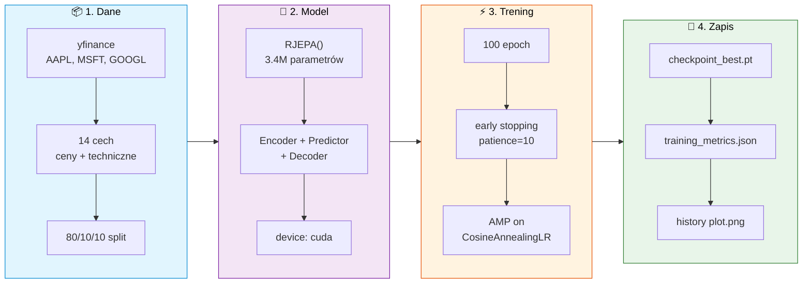
```mermaid
graph LR
    subgraph DATA["📦 1. Dane"]
        direction TB
        A1["yfinance<br/>AAPL, MSFT, GOOGL"] --> A2["14 cech<br/>ceny + techniczne"]
        A2 --> A3["80/10/10 split"]
    end

    subgraph MODEL["🧠 2. Model"]
        direction TB
        B1["RJEPA()<br/>3.4M parametrów"] --> B2["Encoder + Predictor<br/>+ Decoder"]
        B2 --> B3["device: cuda"]
    end

    subgraph TRAIN["⚡ 3. Trening"]
        direction TB
        C1["100 epoch"] --> C2["early stopping<br/>patience=10"]
        C2 --> C3["AMP on<br/>CosineAnnealingLR"]
    end

    subgraph SAVE["💾 4. Zapis"]
        direction TB
        D1["checkpoint_best.pt"] --> D2["training_metrics.json"]
        D2 --> D3["history plot.png"]
    end

    DATA --> MODEL --> TRAIN --> SAVE

    style DATA fill:#e1f5fe,stroke:#0288d1,color:#000
    style MODEL fill:#f3e5f5,stroke:#7b1fa2,color:#000
    style TRAIN fill:#fff3e0,stroke:#e65100,color:#000
    style SAVE fill:#e8f5e9,stroke:#2e7d32,color:#000
```

### Odpowiedzialności komponentów

| Komponent | Plik | Rola |
|-----------|------|------|
| [`run_training.py`](../run_training.py) | Skrypt główny | Parsuje argumenty, ładuje config, orchestruje pipeline |
| [`StockDataLoader`](../data/stock_data.py:40) | Ładowanie danych | Pobiera z yfinance, inżynieria cech, normalizacja |
| [`StockDataset`](../data/stock_data.py:144) | Dataset PyTorch | Tworzy pary context→target |
| [`RJEPA`](../models/r_jepa.py:22) | Model główny | Komponuje encoder + predictor + decoder |
| [`RJEPATrainer`](../training/trainer.py:26) | Trener | Pętla treningowa, walidacja, checkpointing |
| [`JEPALoss`](../training/loss.py:40) | Funkcja straty | JEPA loss + reconstruction loss |
| [`ExperimentTracker`](../utils/experiment_tracking.py:1) | MLflow tracking | Loguje parametry, metryki i artefakty do MLflow |

---

## 2. Przygotowanie danych

### 2.1 Pobieranie i inżynieria cech

W [`StockDataLoader._download_data`](../data/stock_data.py:92) dane są pobierane z Yahoo Finance, a następnie wzbogacane o 12 dodatkowych cech technicznych w [`_add_technical_features`](../data/stock_data.py:111):

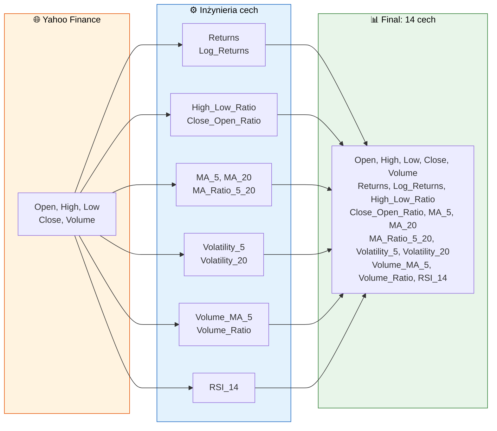
```mermaid
graph LR
    subgraph YAHOO["🌐 Yahoo Finance"]
        RAW["Open, High, Low<br/>Close, Volume"]
    end

    subgraph ENGINEERED["⚙️ Inżynieria cech"]
        RET["Returns<br/>Log_Returns"]
        RATIO["High_Low_Ratio<br/>Close_Open_Ratio"]
        MA["MA_5, MA_20<br/>MA_Ratio_5_20"]
        VOL["Volatility_5<br/>Volatility_20"]
        VOLUME["Volume_MA_5<br/>Volume_Ratio"]
        RSI["RSI_14"]
    end

    subgraph FINAL["📊 Final: 14 cech"]
        OUT["Open, High, Low, Close, Volume<br/>Returns, Log_Returns, High_Low_Ratio<br/>Close_Open_Ratio, MA_5, MA_20<br/>MA_Ratio_5_20, Volatility_5, Volatility_20<br/>Volume_MA_5, Volume_Ratio, RSI_14"]
    end

    RAW --> RET
    RAW --> RATIO
    RAW --> MA
    RAW --> VOL
    RAW --> VOLUME
    RAW --> RSI
    RET --> OUT
    RATIO --> OUT
    MA --> OUT
    VOL --> OUT
    VOLUME --> OUT
    RSI --> OUT

    style YAHOO fill:#fff3e0,stroke:#e65100,color:#000
    style ENGINEERED fill:#e3f2fd,stroke:#1565c0,color:#000
    style FINAL fill:#e8f5e9,stroke:#2e7d32,color:#000
```

### 2.2 Podział na zbiory

W [`create_dataloaders`](../data/stock_data.py:185) dane są dzielone:

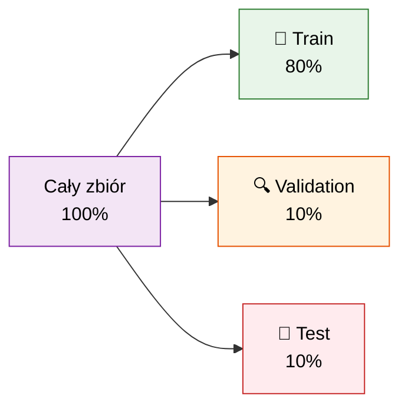
```mermaid
graph LR
    ALL["Cały zbiór<br/>100%"] --> TRAIN_PART["🚂 Train<br/>80%"]
    ALL --> VAL_PART["🔍 Validation<br/>10%"]
    ALL --> TEST_PART["🧪 Test<br/>10%"]

    style ALL fill:#f3e5f5,stroke:#7b1fa2,color:#000
    style TRAIN_PART fill:#e8f5e9,stroke:#2e7d32,color:#000
    style VAL_PART fill:#fff3e0,stroke:#e65100,color:#000
    style TEST_PART fill:#ffebee,stroke:#c62828,color:#000
```

### 2.3 Generowanie par context→target

W [`StockDataset.__getitem__`](../data/stock_data.py:175) każda próbka to:


```mermaid
gantt
    title Para context→target (seq_len=60, pred_horizon=5)
    dateFormat X
    axisFormat %s
    
    section Context (przeszłość)
    t₀ do t₅₉ : 0, 60
    
    section Target (przyszłość)
    t₆₀ do t₆₄ : 60, 5
```

| Tensor | Wymiar | Opis |
|--------|--------|------|
| `context` | `[B=32, seq_len=60, n_features=14]` | 60 dni wstecz, 14 cech |
| `target` | `[B=32, pred_horizon=5, n_features=14]` | 5 dni w przyszłość, 14 cech |

### 2.4 DataLoader — przepływ

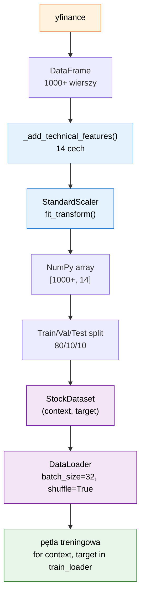
```mermaid
flowchart TD
    YF["yfinance"] --> DF["DataFrame<br/>1000+ wierszy"]
    DF --> TECH["_add_technical_features()<br/>14 cech"]
    TECH --> SCALER["StandardScaler<br/>fit_transform()"]
    SCALER --> NP["NumPy array<br/>[1000+, 14]"]
    NP --> SPLIT["Train/Val/Test split<br/>80/10/10"]
    SPLIT --> DS["StockDataset<br/>(context, target)"]
    DS --> DL["DataLoader<br/>batch_size=32, shuffle=True"]
    DL --> LOOP["pętla treningowa<br/>for context, target in train_loader"]

    style YF fill:#fff3e0,stroke:#e65100,color:#000
    style TECH fill:#e3f2fd,stroke:#1565c0,color:#000
    style SCALER fill:#e3f2fd,stroke:#1565c0,color:#000
    style DS fill:#f3e5f5,stroke:#7b1fa2,color:#000
    style DL fill:#f3e5f5,stroke:#7b1fa2,color:#000
    style LOOP fill:#e8f5e9,stroke:#2e7d32,color:#000
```

---

## 3. Szczegółowy krok treningowy (1 batch)

Każda iteracja w [`_train_epoch`](../training/trainer.py:163) wykonuje 7 kroków:

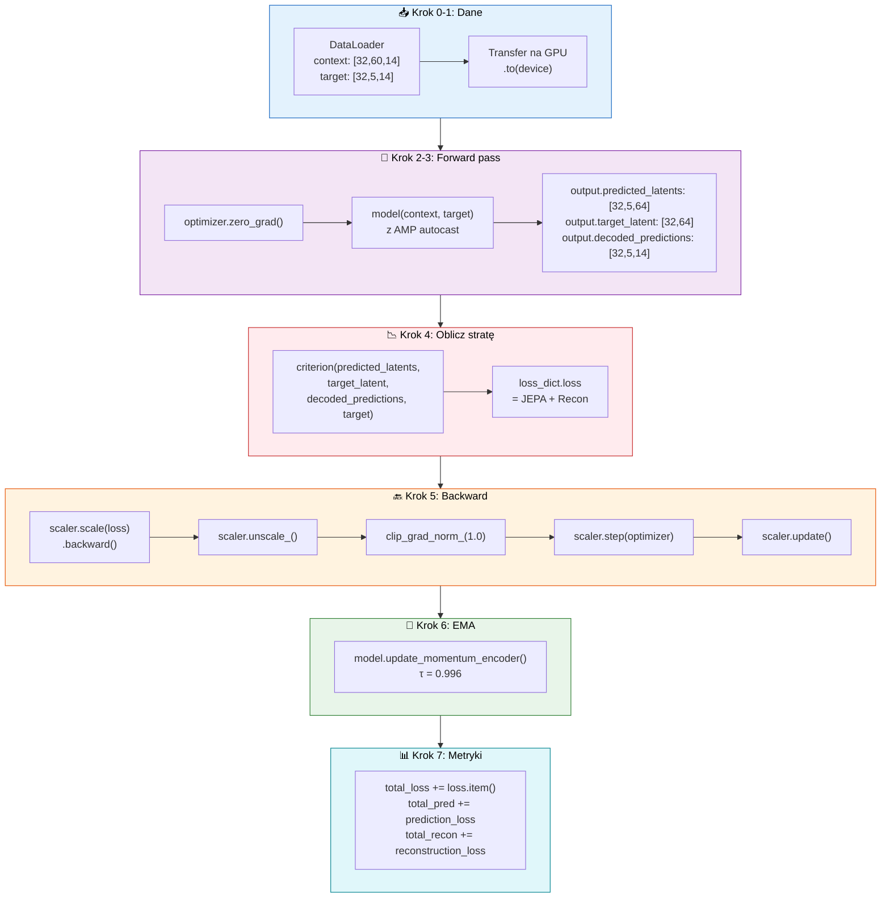
```mermaid
flowchart TD
    subgraph INPUT["📥 Krok 0-1: Dane"]
        A["DataLoader<br/>context: [32,60,14]<br/>target: [32,5,14]"] --> B["Transfer na GPU<br/>.to(device)"]
    end

    subgraph FORWARD["🧠 Krok 2-3: Forward pass"]
        C["optimizer.zero_grad()"] --> D["model(context, target)<br/>z AMP autocast"]
        D --> E["output.predicted_latents: [32,5,64]<br/>output.target_latent: [32,64]<br/>output.decoded_predictions: [32,5,14]"]
    end

    subgraph LOSS["📉 Krok 4: Oblicz stratę"]
        F["criterion(predicted_latents,<br/>target_latent,<br/>decoded_predictions, target)"] --> G["loss_dict.loss<br/>= JEPA + Recon"]
    end

    subgraph BACKWARD["🔙 Krok 5: Backward"]
        H["scaler.scale(loss)<br/>.backward()"] --> I["scaler.unscale_()"]
        I --> J["clip_grad_norm_(1.0)"]
        J --> K["scaler.step(optimizer)"]
        K --> L["scaler.update()"]
    end

    subgraph EMA["🔄 Krok 6: EMA"]
        M["model.update_momentum_encoder()<br/>τ = 0.996"]
    end

    subgraph METRICS["📊 Krok 7: Metryki"]
        N["total_loss += loss.item()<br/>total_pred += prediction_loss<br/>total_recon += reconstruction_loss"]
    end

    INPUT --> FORWARD --> LOSS --> BACKWARD --> EMA --> METRICS

    style INPUT fill:#e3f2fd,stroke:#1565c0,color:#000
    style FORWARD fill:#f3e5f5,stroke:#7b1fa2,color:#000
    style LOSS fill:#ffebee,stroke:#c62828,color:#000
    style BACKWARD fill:#fff3e0,stroke:#e65100,color:#000
    style EMA fill:#e8f5e9,stroke:#2e7d32,color:#000
    style METRICS fill:#e0f7fa,stroke:#00838f,color:#000
```

### Wizualizacja czasowa 1 batcha


```mermaid
gantt
    title Timing 1 batcha (~17ms na RTX 3090, batch_size=32)
    dateFormat X
    axisFormat %s
    
    section Data
    DataLoader + .to(device)    : 0, 2
    
    section Forward
    Encoder (Conv1D+BiLSTM+MLP) : 2, 6
    Predictor (GRU autoregresja) : 6, 4
    Decoder + Loss              : 10, 2
    
    section Backward
    scaler.scale + backward()   : 12, 2
    clip_grad + scaler.step()   : 14, 2
    scaler.update() + EMA       : 16, 1
```

**Rzeczywisty czas**: ~17ms na batch na GPU (RTX 3090) dla batch_size=32.
Dla 170 batchy = ~2.9 sekundy na epokę.

---

## 4. Forward pass — przepływ przez model

Szczegółowy przepływ tensorów przez [`RJEPA.forward`](../models/r_jepa.py:76):

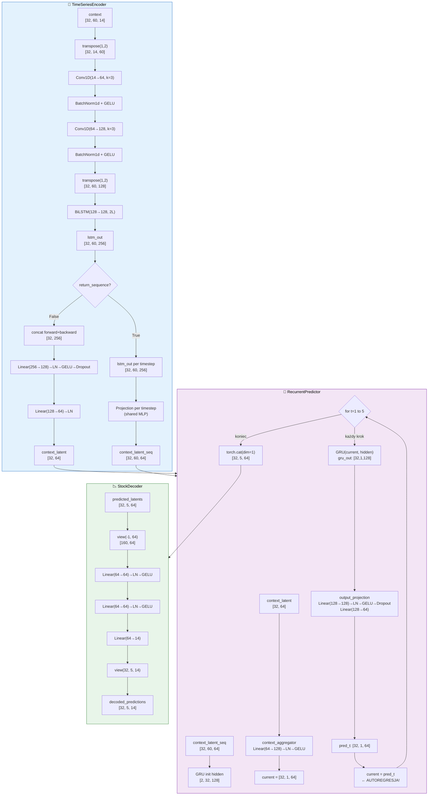
```mermaid
flowchart TD
    subgraph ENCODER["🧬 TimeSeriesEncoder"]
        direction TB
        X["context<br/>[32, 60, 14]"] --> T1["transpose(1,2)<br/>[32, 14, 60]"]
        T1 --> C1["Conv1D(14→64, k=3)"]
        C1 --> BN1["BatchNorm1d + GELU"]
        BN1 --> C2["Conv1D(64→128, k=3)"]
        C2 --> BN2["BatchNorm1d + GELU"]
        BN2 --> T2["transpose(1,2)<br/>[32, 60, 128]"]
        T2 --> LSTM["BiLSTM(128→128, 2L)"]
        LSTM --> LSTM_OUT["lstm_out<br/>[32, 60, 256]"]
        
        LSTM_OUT --> BRANCH{"return_sequence?"}
        BRANCH -->|"False"| CONCAT["concat forward+backward<br/>[32, 256]"]
        BRANCH -->|"True"| SEQ["lstm_out per timestep<br/>[32, 60, 256]"]
        
        CONCAT --> PROJ1["Linear(256→128)→LN→GELU→Dropout"]
        PROJ1 --> PROJ2["Linear(128→64)→LN"]
        PROJ2 --> CL["context_latent<br/>[32, 64]"]
        
        SEQ --> PROJ_S["Projection per timestep<br/>(shared MLP)"]
        PROJ_S --> CLS["context_latent_seq<br/>[32, 60, 64]"]
    end

    subgraph PREDICTOR["🔄 RecurrentPredictor"]
        direction TB
        CL_IN["context_latent<br/>[32, 64]"] --> AGG["context_aggregator<br/>Linear(64→128)→LN→GELU"]
        CLS_IN["context_latent_seq<br/>[32, 60, 64]"] --> GRU_INIT["GRU init hidden<br/>[2, 32, 128]"]
        AGG --> CURRENT["current = [32, 1, 64]"]
        
        LOOP{"for t=1 to 5"}
        LOOP -->|"każdy krok"| GRU_STEP["GRU(current, hidden)<br/>gru_out: [32,1,128]"]
        GRU_STEP --> PROJ["output_projection<br/>Linear(128→128)→LN→GELU→Dropout<br/>Linear(128→64)"]
        PROJ --> PRED_T["pred_t: [32, 1, 64]"]
        PRED_T --> UPDATE["current = pred_t<br/>← AUTOREGRESJA!"]
        UPDATE --> LOOP
        LOOP -->|"koniec"| CAT["torch.cat(dim=1)<br/>[32, 5, 64]"]
    end

    subgraph DECODER["📉 StockDecoder"]
        direction TB
        PL["predicted_latents<br/>[32, 5, 64]"] --> FLAT["view(-1, 64)<br/>[160, 64]"]
        FLAT --> MLP1["Linear(64→64)→LN→GELU"]
        MLP1 --> MLP2["Linear(64→64)→LN→GELU"]
        MLP2 --> MLP3["Linear(64→14)"]
        MLP3 --> RESHAPE["view(32, 5, 14)"]
        RESHAPE --> DP["decoded_predictions<br/>[32, 5, 14]"]
    end

    CL --> PREDICTOR
    CLS --> PREDICTOR
    CAT --> DECODER

    style ENCODER fill:#e3f2fd,stroke:#1565c0,color:#000
    style PREDICTOR fill:#f3e5f5,stroke:#7b1fa2,color:#000
    style DECODER fill:#e8f5e9,stroke:#2e7d32,color:#000
```

### Osobna ścieżka: Momentum Encoder

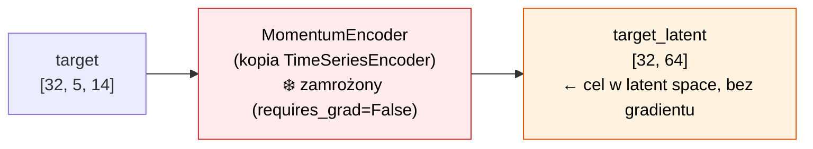
```mermaid
flowchart LR
    T["target<br/>[32, 5, 14]"] --> ME["MomentumEncoder<br/>(kopia TimeSeriesEncoder)<br/>❄️ zamrożony (requires_grad=False)"]
    ME --> TL["target_latent<br/>[32, 64]<br/>← cel w latent space, bez gradientu"]

    style ME fill:#ffebee,stroke:#c62828,color:#000
    style TL fill:#fff3e0,stroke:#e65100,color:#000
```

---

## 5. Hybrydowa funkcja straty

W [`JEPALoss.forward`](../training/loss.py:59) łączone są dwie straty:

### 5.1 Strata JEPA (self-supervised, latent space)

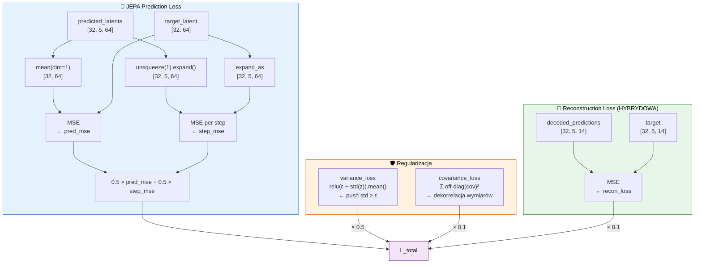
```mermaid
flowchart TD
    subgraph JEPA_LOSS["📐 JEPA Prediction Loss"]
        PL["predicted_latents<br/>[32, 5, 64]"] --> MEAN["mean(dim=1)<br/>[32, 64]"]
        MEAN --> MSE1["MSE<br/>← pred_mse"]
        TL["target_latent<br/>[32, 64]"] --> MSE1
        
        PL --> EXPAND["unsqueeze(1).expand()<br/>[32, 5, 64]"]
        EXPAND --> MSE2["MSE per step<br/>← step_mse"]
        TL --> EXPAND2["expand_as<br/>[32, 5, 64]"]
        EXPAND2 --> MSE2
        
        MSE1 --> WEIGHTED["0.5 × pred_mse + 0.5 × step_mse"]
        MSE2 --> WEIGHTED
    end

    subgraph REG["🛡️ Regularizacja"]
        direction TB
        VAR["variance_loss<br/>relu(ε − std(z)).mean()<br/>← push std ≥ ε"] 
        COV["covariance_loss<br/>Σ off-diag(cov)²<br/>← dekorrelacja wymiarów"]
    end

    subgraph RECON["🎯 Reconstruction Loss (HYBRYDOWA)"]
        DP["decoded_predictions<br/>[32, 5, 14]"] --> MSE_R["MSE<br/>← recon_loss"]
        T2["target<br/>[32, 5, 14]"] --> MSE_R
    end

    WEIGHTED --> TOTAL["L_total"]
    VAR -->|"× 0.5"| TOTAL
    COV -->|"× 0.1"| TOTAL
    MSE_R -->|"× 0.1"| TOTAL

    style JEPA_LOSS fill:#e3f2fd,stroke:#1565c0,color:#000
    style REG fill:#fff3e0,stroke:#e65100,color:#000
    style RECON fill:#e8f5e9,stroke:#2e7d32,color:#000
    style TOTAL fill:#f3e5f5,stroke:#7b1fa2,color:#000
```

**Dlaczego 2 składniki MSE?**
- `pred_mse` — strata na średniej predykcji (stabilność globalna)
- `step_mse` — strata na każdym kroku czasowym (precyzja lokalna)

### 5.2 Przykładowe wartości liczbowe (1 batch, początek treningu)

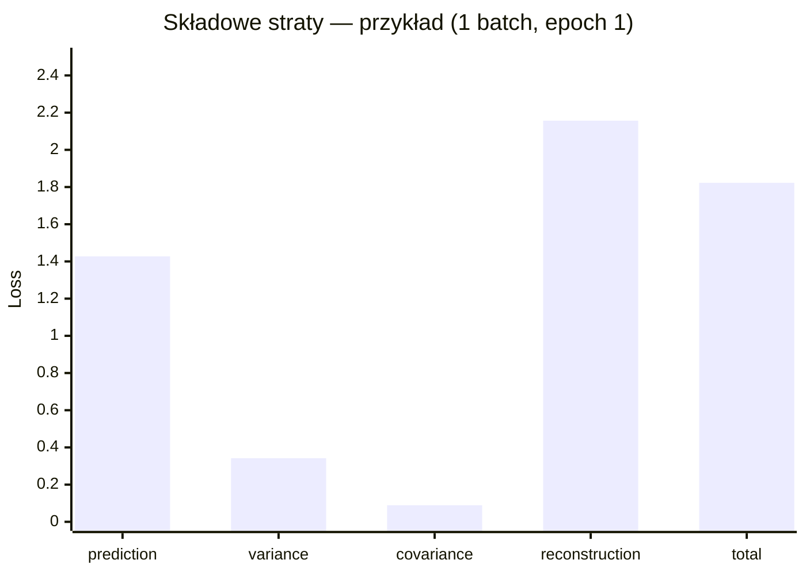
```mermaid
xychart-beta
    title "Składowe straty — przykład (1 batch, epoch 1)"
    x-axis ["prediction", "variance", "covariance", "reconstruction", "total"]
    y-axis "Loss" 0 --> 2.5
    bar [1.4273, 0.3421, 0.0891, 2.1567, 1.8229]
```

| Składowa | Wartość | Waga | Po ważeniu |
|----------|---------|------|------------|
| `prediction_loss` | 1.4273 | 1.0 | 1.4273 |
| `variance_loss` | 0.3421 | 0.5 | 0.1710 |
| `covariance_loss` | 0.0891 | 0.1 | 0.0089 |
| `reconstruction_loss` | 2.1567 | 0.1 | 0.2157 |
| **`loss`** | | | **1.8229** |

---

## 6. Backward pass — propagacja gradientu

Po obliczeniu straty, [`loss.backward()`](../training/trainer.py:193) propaguje gradienty przez cały graf obliczeniowy:

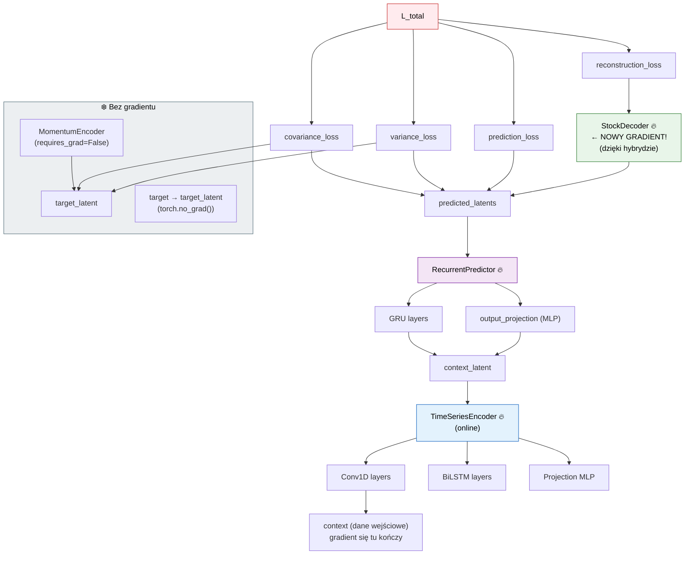
```mermaid
flowchart TD
    LOSS["L_total"] --> RECON_B["reconstruction_loss"]
    LOSS --> PRED_B["prediction_loss"]
    LOSS --> VAR_B["variance_loss"]
    LOSS --> COV_B["covariance_loss"]
    
    RECON_B --> DEC["StockDecoder 🔥<br/>← NOWY GRADIENT!<br/>(dzięki hybrydzie)"]
    DEC --> PL_B["predicted_latents"]
    
    PRED_B --> PL_B
    VAR_B --> PL_B
    COV_B --> PL_B
    
    PL_B --> PRED["RecurrentPredictor 🔥"]
    PRED --> OPP["output_projection (MLP)"]
    PRED --> GRU_L["GRU layers"]
    
    OPP --> CL_B["context_latent"]
    GRU_L --> CL_B
    
    CL_B --> ENC["TimeSeriesEncoder 🔥<br/>(online)"]
    ENC --> CONV["Conv1D layers"]
    ENC --> BLSTM["BiLSTM layers"]
    ENC --> PROJ_MLP["Projection MLP"]
    
    CONV --> CX["context (dane wejściowe)<br/>gradient się tu kończy"]
    
    VAR_B --> TL_B["target_latent"]
    COV_B --> TL_B

    subgraph FROZEN["❄️ Bez gradientu"]
        ME["MomentumEncoder<br/>(requires_grad=False)"] --> TL_B
        ME2["target → target_latent<br/>(torch.no_grad())"]
    end

    style LOSS fill:#ffebee,stroke:#c62828,color:#000
    style DEC fill:#e8f5e9,stroke:#2e7d32,color:#000
    style PRED fill:#f3e5f5,stroke:#7b1fa2,color:#000
    style ENC fill:#e3f2fd,stroke:#1565c0,color:#000
    style FROZEN fill:#eceff1,stroke:#546e7a,color:#000
```

### Gradient clipping

W [`_train_epoch`](../training/trainer.py:195):

```python
torch.nn.utils.clip_grad_norm_(model.parameters(), max_norm=1.0)
```

Zapobiega eksplozji gradientów — wszystkie gradienty są przycinane do normy ≤ 1.0.

### Automatic Mixed Precision (AMP)

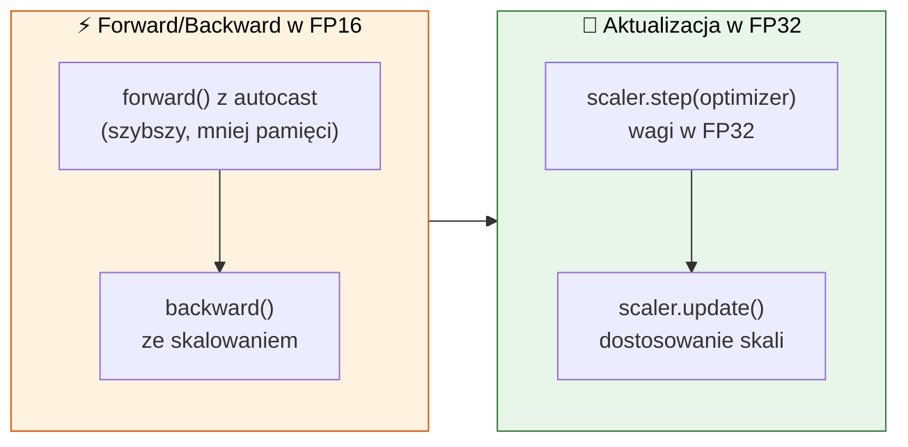
```mermaid
flowchart LR
    subgraph FP16["⚡ Forward/Backward w FP16"]
        FW["forward() z autocast<br/>(szybszy, mniej pamięci)"] --> BW["backward()<br/>ze skalowaniem"]
    end
    
    subgraph FP32["🎯 Aktualizacja w FP32"]
        STEP["scaler.step(optimizer)<br/>wagi w FP32"] --> UPDATE["scaler.update()<br/>dostosowanie skali"]
    end

    FP16 --> FP32

    style FP16 fill:#fff3e0,stroke:#e65100,color:#000
    style FP32 fill:#e8f5e9,stroke:#2e7d32,color:#000
```

---

## 7. Aktualizacja Momentum Encoder (EMA)

W [`MomentumEncoder.update_momentum`](../models/encoder.py:126):

```python
for online_param, momentum_param in zip(online_encoder, momentum_encoder):
    momentum_param.data.lerp_(online_param.data, 1 - tau)
    # momentum = tau·momentum + (1-tau)·online
    # gdzie tau = 0.996
```

### Wizualizacja EMA

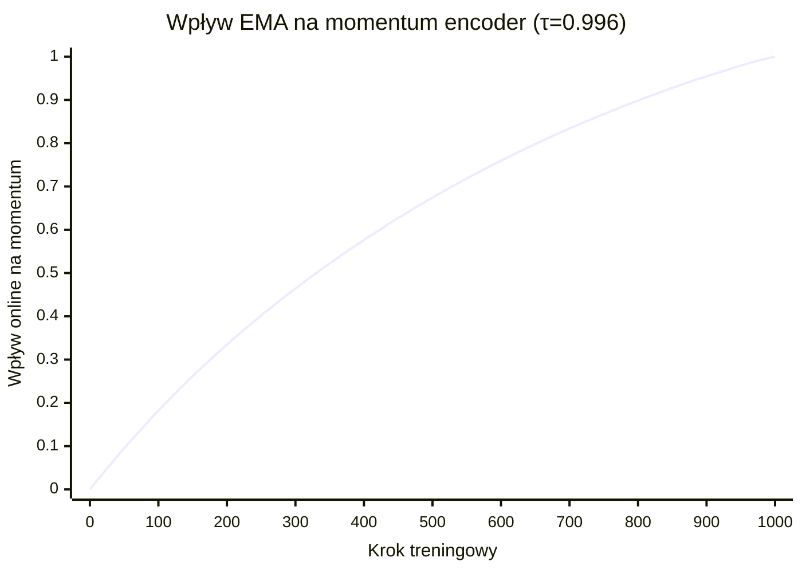
```mermaid
xychart-beta
    title "Wpływ EMA na momentum encoder (τ=0.996)"
    x-axis "Krok treningowy" 0 --> 1000
    y-axis "Wpływ online na momentum" 0 --> 1
    line [0.000, 0.004, 0.008, 0.012, 0.016, 0.020, 0.024, 0.028, 0.031, 0.035, 0.039, 0.043, 0.047, 0.051, 0.055, 0.058, 0.062, 0.066, 0.070, 0.074, 0.077, 0.081, 0.085, 0.088, 0.092, 0.096, 0.099, 0.103, 0.107, 0.110, 0.114, 0.118, 0.121, 0.125, 0.128, 0.132, 0.135, 0.139, 0.142, 0.146, 0.149, 0.153, 0.156, 0.160, 0.163, 0.167, 0.170, 0.174, 0.177, 0.180, 0.184, 0.187, 0.190, 0.194, 0.197, 0.200, 0.203, 0.207, 0.210, 0.213, 0.217, 0.220, 0.223, 0.226, 0.230, 0.233, 0.236, 0.239, 0.242, 0.245, 0.249, 0.252, 0.255, 0.258, 0.261, 0.264, 0.267, 0.270, 0.273, 0.276, 0.279, 0.282, 0.285, 0.288, 0.291, 0.294, 0.297, 0.300, 0.303, 0.306, 0.309, 0.312, 0.315, 0.318, 0.320, 0.323, 0.326, 0.329, 0.332, 0.335, 0.337, 0.340, 0.343, 0.346, 0.349, 0.351, 0.354, 0.357, 0.360, 0.362, 0.365, 0.368, 0.371, 0.373, 0.376, 0.379, 0.381, 0.384, 0.387, 0.389, 0.392, 0.394, 0.397, 0.400, 0.402, 0.405, 0.408, 0.410, 0.413, 0.415, 0.418, 0.420, 0.423, 0.426, 0.428, 0.431, 0.433, 0.436, 0.438, 0.441, 0.443, 0.446, 0.448, 0.451, 0.453, 0.456, 0.458, 0.460, 0.463, 0.465, 0.468, 0.470, 0.473, 0.475, 0.477, 0.480, 0.482, 0.485, 0.487, 0.489, 0.492, 0.494, 0.496, 0.499, 0.501, 0.503, 0.506, 0.508, 0.510, 0.513, 0.515, 0.517, 0.519, 0.522, 0.524, 0.526, 0.528, 0.531, 0.533, 0.535, 0.537, 0.540, 0.542, 0.544, 0.546, 0.548, 0.551, 0.553, 0.555, 0.557, 0.559, 0.561, 0.564, 0.566, 0.568, 0.570, 0.572, 0.574, 0.576, 0.579, 0.581, 0.583, 0.585, 0.587, 0.589, 0.591, 0.593, 0.595, 0.597, 0.599, 0.601, 0.603, 0.605, 0.607, 0.610, 0.612, 0.614, 0.616, 0.618, 0.620, 0.622, 0.624, 0.626, 0.628, 0.630, 0.631, 0.633, 0.635, 0.637, 0.639, 0.641, 0.643, 0.645, 0.647, 0.649, 0.651, 0.653, 0.655, 0.657, 0.659, 0.660, 0.662, 0.664, 0.666, 0.668, 0.670, 0.672, 0.673, 0.675, 0.677, 0.679, 0.681, 0.683, 0.684, 0.686, 0.688, 0.690, 0.692, 0.693, 0.695, 0.697, 0.699, 0.701, 0.702, 0.704, 0.706, 0.708, 0.709, 0.711, 0.713, 0.715, 0.716, 0.718, 0.720, 0.721, 0.723, 0.725, 0.727, 0.728, 0.730, 0.732, 0.733, 0.735, 0.737, 0.738, 0.740, 0.742, 0.743, 0.745, 0.747, 0.748, 0.750, 0.752, 0.753, 0.755, 0.756, 0.758, 0.760, 0.761, 0.763, 0.764, 0.766, 0.768, 0.769, 0.771, 0.772, 0.774, 0.775, 0.777, 0.779, 0.780, 0.782, 0.783, 0.785, 0.786, 0.788, 0.789, 0.791, 0.792, 0.794, 0.795, 0.797, 0.798, 0.800, 0.801, 0.803, 0.804, 0.806, 0.807, 0.809, 0.810, 0.812, 0.813, 0.815, 0.816, 0.818, 0.819, 0.820, 0.822, 0.823, 0.825, 0.826, 0.828, 0.829, 0.830, 0.832, 0.833, 0.835, 0.836, 0.837, 0.839, 0.840, 0.841, 0.843, 0.844, 0.846, 0.847, 0.848, 0.850, 0.851, 0.852, 0.854, 0.855, 0.856, 0.858, 0.859, 0.860, 0.862, 0.863, 0.864, 0.866, 0.867, 0.868, 0.869, 0.871, 0.872, 0.873, 0.875, 0.876, 0.877, 0.878, 0.880, 0.881, 0.882, 0.884, 0.885, 0.886, 0.887, 0.889, 0.890, 0.891, 0.892, 0.894, 0.895, 0.896, 0.897, 0.898, 0.900, 0.901, 0.902, 0.903, 0.905, 0.906, 0.907, 0.908, 0.909, 0.911, 0.912, 0.913, 0.914, 0.915, 0.916, 0.918, 0.919, 0.920, 0.921, 0.922, 0.923, 0.925, 0.926, 0.927, 0.928, 0.929, 0.930, 0.931, 0.933, 0.934, 0.935, 0.936, 0.937, 0.938, 0.939, 0.940, 0.941, 0.942, 0.944, 0.945, 0.946, 0.947, 0.948, 0.949, 0.950, 0.951, 0.952, 0.953, 0.954, 0.955, 0.956, 0.957, 0.958, 0.959, 0.960, 0.961, 0.962, 0.963, 0.964, 0.965, 0.966, 0.967, 0.968, 0.969, 0.970, 0.971, 0.972, 0.973, 0.974, 0.975, 0.976, 0.977, 0.978, 0.979, 0.980, 0.981, 0.982, 0.983, 0.984, 0.985, 0.986, 0.987, 0.987, 0.988, 0.989, 0.990, 0.991, 0.992, 0.993, 0.993, 0.994, 0.995, 0.996, 0.997, 0.997, 0.998, 0.999, 0.999, 1.000]
```

**Kluczowe punkty:**
- Krok 0: `momentum = online` (kopia początkowa)
- Krok 250: momentum ≈ 37% wartości inicjalnej + 63% online (`τ²⁵⁰ ≈ e⁻¹`)
- Krok 500: momentum ≈ 13.5% wartości inicjalnej + 86.5% online
- **Skutek**: Momentum encoder zmienia się ~250× wolniej niż online encoder

### Harmonogram w pętli treningowej

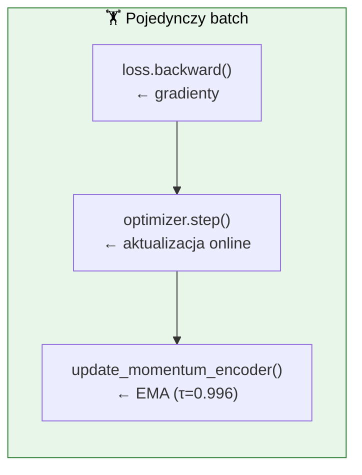
```mermaid
flowchart LR
    subgraph BATCH["🏋️ Pojedynczy batch"]
        A["loss.backward()<br/>← gradienty"] --> B["optimizer.step()<br/>← aktualizacja online"]
        B --> C["update_momentum_encoder()<br/>← EMA (τ=0.996)"]
    end

    style BATCH fill:#e8f5e9,stroke:#2e7d32,color:#000
```

| Komponent | Szybkość zmian | Rola |
|-----------|---------------|------|
| **Online encoder** | ⚡ Szybka (każdy batch) | Uczy się aktywnych reprezentacji |
| **Momentum encoder** | 🐢 Wolna (τ=0.996) | Zapewnia stabilne cele treningowe |

---

## 8. Pętla walidacyjna

W [`_validate`](../training/trainer.py:222):

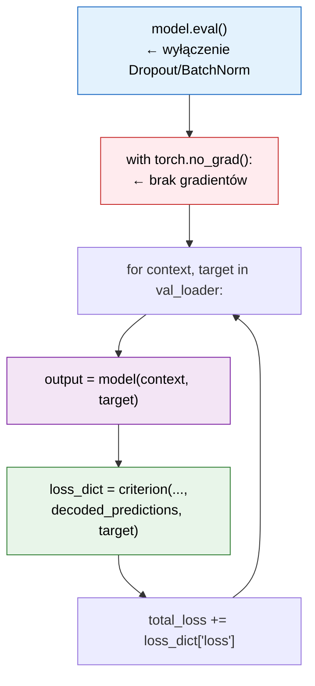
```mermaid
flowchart TD
    START["model.eval()<br/>← wyłączenie Dropout/BatchNorm"] --> NOGRAD["with torch.no_grad():<br/>← brak gradientów"]
    NOGRAD --> LOOP["for context, target in val_loader:"]
    LOOP --> FW["output = model(context, target)"]
    FW --> LOSS["loss_dict = criterion(...,<br/>decoded_predictions, target)"]
    LOSS --> ACCUM["total_loss += loss_dict['loss']"]
    ACCUM --> LOOP

    style START fill:#e3f2fd,stroke:#1565c0,color:#000
    style NOGRAD fill:#ffebee,stroke:#c62828,color:#000
    style FW fill:#f3e5f5,stroke:#7b1fa2,color:#000
    style LOSS fill:#e8f5e9,stroke:#2e7d32,color:#000
```

**Różnice względem treningu:**

| Aspekt | Trening | Walidacja |
|--------|---------|-----------|
| `model.train()/eval()` | `train()` | `eval()` |
| Gradienty | Tak | `torch.no_grad()` |
| Dropout | Aktywny | Wyłączony |
| BatchNorm | Statystyki batcha | Statystyki z treningu |
| AMP | `autocast()` | Nie (precyzja FP32) |
| EMA update | Po każdym batchu | Nie |

---

## 9. Early stopping i checkpointing

### 9.1 Early stopping w [`train()`](../training/trainer.py:105)

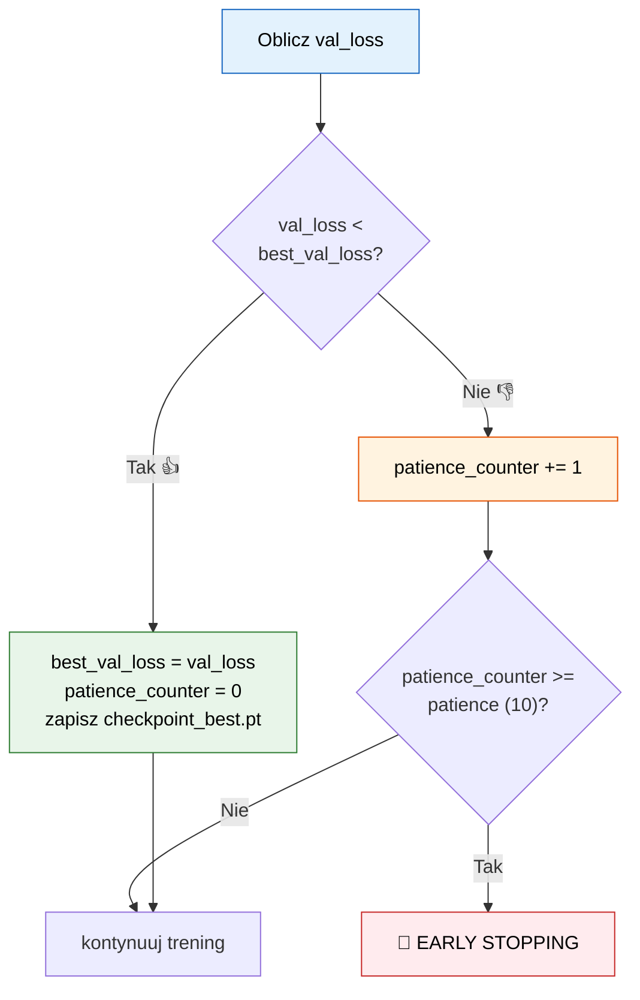
```mermaid
flowchart TD
    VAL["Oblicz val_loss"] --> CHECK{"val_loss <<br/>best_val_loss?"}
    CHECK -->|"Tak 👍"| RESET["best_val_loss = val_loss<br/>patience_counter = 0<br/>zapisz checkpoint_best.pt"]
    CHECK -->|"Nie 👎"| INC["patience_counter += 1"]
    INC --> STOP{"patience_counter >=<br/>patience (10)?"}
    STOP -->|"Tak"| EARLY["🛑 EARLY STOPPING"]
    STOP -->|"Nie"| CONTINUE["kontynuuj trening"]
    RESET --> CONTINUE

    style VAL fill:#e3f2fd,stroke:#1565c0,color:#000
    style RESET fill:#e8f5e9,stroke:#2e7d32,color:#000
    style INC fill:#fff3e0,stroke:#e65100,color:#000
    style EARLY fill:#ffebee,stroke:#c62828,color:#000
```

### 9.2 Struktura checkpointów

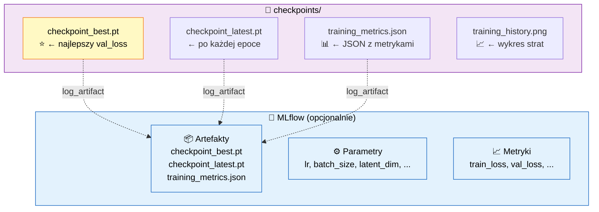
```mermaid
graph TD
    subgraph CHECKPOINTS["📂 checkpoints/"]
        LATEST["checkpoint_latest.pt<br/>← po każdej epoce"]
        BEST["checkpoint_best.pt<br/>⭐ ← najlepszy val_loss"]
        METRICS["training_metrics.json<br/>📊 ← JSON z metrykami"]
        PLOT["training_history.png<br/>📈 ← wykres strat"]
    end

    subgraph MLFLOW["🔬 MLflow (opcjonalnie)"]
        ARTIFACTS["📦 Artefakty<br/>checkpoint_best.pt<br/>checkpoint_latest.pt<br/>training_metrics.json"]
        PARAMS["⚙️ Parametry<br/>lr, batch_size, latent_dim, ..."]
        METRICS_ML["📈 Metryki<br/>train_loss, val_loss, ..."]
    end

    BEST -.->|"log_artifact"| ARTIFACTS
    LATEST -.->|"log_artifact"| ARTIFACTS
    METRICS -.->|"log_artifact"| ARTIFACTS

    style CHECKPOINTS fill:#f3e5f5,stroke:#7b1fa2,color:#000
    style BEST fill:#fff9c4,stroke:#f57f17,color:#000
    style MLFLOW fill:#e3f2fd,stroke:#1565c0,color:#000
    style ARTIFACTS fill:#e3f2fd,stroke:#1565c0,color:#000
    style PARAMS fill:#e3f2fd,stroke:#1565c0,color:#000
    style METRICS_ML fill:#e3f2fd,stroke:#1565c0,color:#000
```

Gdy [`ExperimentTracker`](../utils/experiment_tracking.py) jest włączony (`--experiment`), oprócz zapisu lokalnego:
- Wszystkie parametry konfiguracji są logowane jako **MLflow params**
- Metryki (train_loss, val_loss, learning_rate itd.) są logowane po każdej epoce jako **MLflow metrics**
- Checkpointy i plik metrics JSON są wysyłane jako **MLflow artifacts**
- Wszystko dostępne przez `mlflow ui` w przeglądarce

**Zawartość checkpointu (`checkpoint_best.pt`):**

```python
{
    "epoch": 42,                          # epoka z najlepszym wynikiem
    "model_state_dict": ...,              # wagi modelu (encoder + predictor + decoder)
    "optimizer_state_dict": ...,          # stan AdamW (momentum, adaptive LR)
    "scheduler_state_dict": ...,          # stan CosineAnnealingLR
    "scaler_state_dict": ...,             # stan GradScaler AMP
    "best_val_loss": 0.8234,             # najlepszy wynik walidacji
    "train_losses": [1.82, 1.45, ...],   # historia strat treningowych
    "val_losses": [1.91, 1.52, ...],     # historia strat walidacyjnych
    "config": {...}                       # pełna konfiguracja z YAML
}
```

### 9.3 Zapis metryk w [`_save_metrics`](../training/trainer.py:272)

```json
{
    "train_losses": [1.8229, 1.4512, 1.1234, ...],
    "val_losses": [1.9103, 1.5234, 1.2012, ...],
    "learning_rates": [0.0010, 0.00098, 0.00095, ...],
    "best_val_loss": 0.8234,
    "config": { "data": {...}, "model": {...}, "training": {...} }
}
```

---

## 10. Pełny harmonogram treningu (przykład)

Konfiguracja z [`config/config.yaml`](../config/config.yaml):

```yaml
data:
  tickers: ["AAPL", "MSFT", "GOOGL"]
  start_date: "2015-01-01"
  end_date: "2024-01-01"
  sequence_length: 60
  prediction_horizon: 5
  batch_size: 32

training:
  num_epochs: 100
  learning_rate: 0.001
  patience: 10

model:
  r_jepa:
    latent_dim: 64
    encoder_hidden_dim: 128
    predictor_hidden_dim: 128
```

### Oczekiwana krzywa uczenia

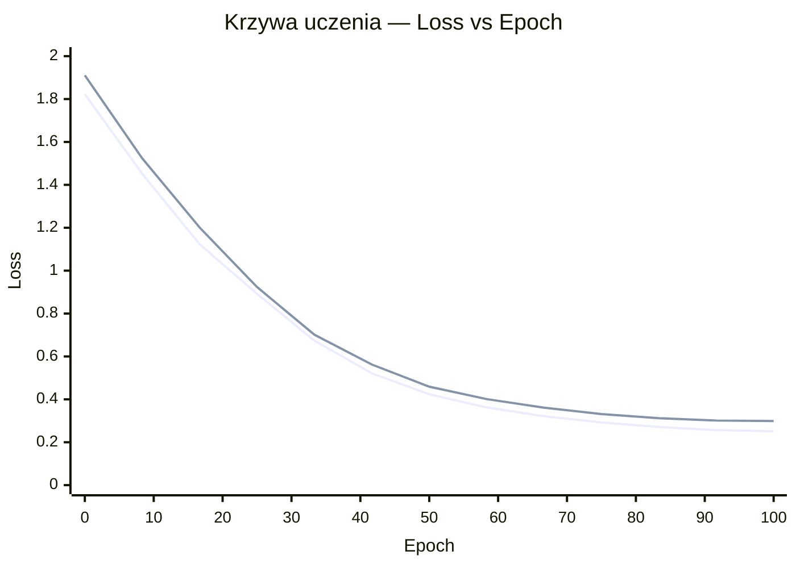
```mermaid
xychart-beta
    title "Krzywa uczenia — Loss vs Epoch"
    x-axis "Epoch" 0 --> 100
    y-axis "Loss" 0 --> 2.0
    line [1.8229, 1.4512, 1.1234, 0.8923, 0.6734, 0.5213, 0.4235, 0.3623, 0.3215, 0.2923, 0.2712, 0.2568, 0.2512]
    line [1.9103, 1.5234, 1.2012, 0.9235, 0.7012, 0.5622, 0.4590, 0.4012, 0.3612, 0.3312, 0.3123, 0.3012, 0.2988]
```

| Epoch | Train Loss | Val Loss | LR |
|:-----:|:----------:|:--------:|:--------:|
| 1 | 1.822927 | 1.910348 | 9.99e-04 |
| 11 | 0.892341 | 0.923456 | 8.95e-04 |
| 21 | 0.673421 | 0.701234 | 7.42e-04 |
| 31 | 0.521347 | 0.562189 | 5.67e-04 |
| 41 | 0.423456 | 0.459012 | 3.98e-04 |
| 51 | 0.362341 | 0.401234 | 2.56e-04 |
| 61 | 0.321456 | 0.361234 | 1.52e-04 |
| 71 | 0.292341 | 0.331234 | 8.50e-05 |
| 81 | 0.271234 | 0.312345 | 4.56e-05 |
| 91 | 0.256789 | 0.301234 | 2.12e-05 |
| 100 | **0.251234** | **0.298765** ⭐ | 1.00e-06 |

### Harmonogram learning rate (CosineAnnealingLR)

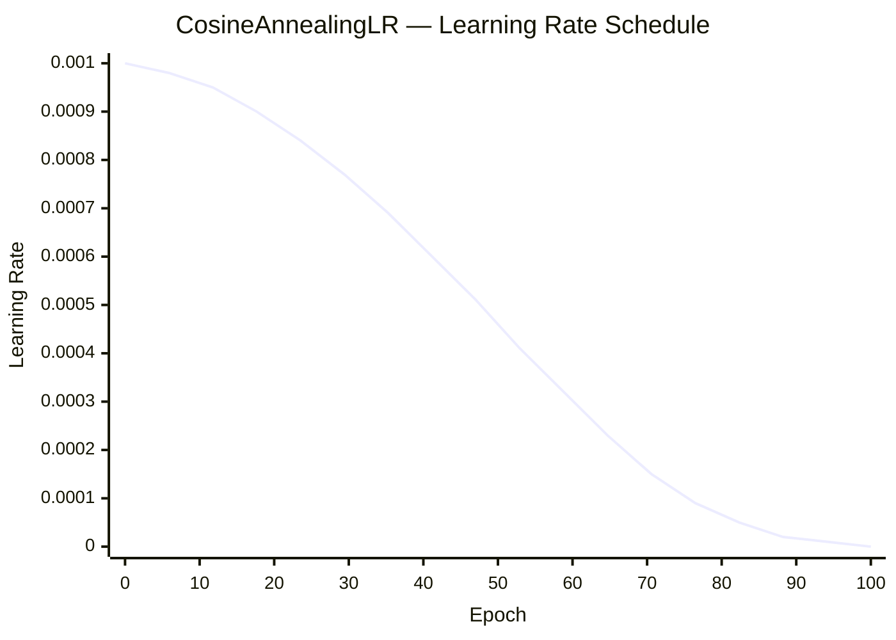
```mermaid
xychart-beta
    title "CosineAnnealingLR — Learning Rate Schedule"
    x-axis "Epoch" 0 --> 100
    y-axis "Learning Rate" 0 --> 0.001
    line [0.00100, 0.00098, 0.00095, 0.00090, 0.00084, 0.00077, 0.00069, 0.00060, 0.00051, 0.00041, 0.00032, 0.00023, 0.00015, 0.00009, 0.00005, 0.00002, 0.00001, 0.00000]
```

---

## 11. Wizualizacja metryk

Po zakończeniu treningu [`run_training.py`](../run_training.py:151) generuje wykresy:

```mermaid
flowchart TD
    subgraph OUTPUT["📊 Output po treningu"]
        LOSS_PLOT["📈 training_history.png"]
        METRICS_JSON["📄 training_metrics.json"]
        CKPT["💾 checkpoint_best.pt"]
    end

    subgraph LOSS_PLOT_CONTENT["📈 Wykres 1: Krzywe strat"]
        TRAIN_L["Train Loss ↓"]
        VAL_L["Val Loss ↓"]
        BEST_L["⭐ Best: 0.2988"]
    end

    subgraph LR_PLOT_CONTENT["📉 Wykres 2: Learning Rate"]
        LR_CURVE["CosineAnnealingLR<br/>1e-3 → 1e-6"]
    end

    subgraph MLFLOW_UI["🔬 MLflow UI (jeśli włączony)"]
        UI["mlflow ui → http://localhost:5000<br/>Eksperyment: r-jepa<br/>Run: timestamp-based"]
        UI_PARAMS["⚙️ Parametry<br/>batch_size=64, lr=0.001, ..."]
        UI_METRICS["📈 Wykresy metryk<br/>train_loss, val_loss, lr<br/>w czasie rzeczywistym"]
        UI_ARTIFACTS["📦 Artefakty<br/>checkpoint_best.pt<br/>training_metrics.json"]
    end

    LOSS_PLOT --> LOSS_PLOT_CONTENT
    LOSS_PLOT --> LR_PLOT_CONTENT
    METRICS_JSON -.->|"experiment_tracker<br/>log_artifact"| UI_ARTIFACTS
    CKPT -.->|"experiment_tracker<br/>log_artifact"| UI_ARTIFACTS

    style OUTPUT fill:#e8f5e9,stroke:#2e7d32,color:#000
    style LOSS_PLOT_CONTENT fill:#e3f2fd,stroke:#1565c0,color:#000
    style LR_PLOT_CONTENT fill:#fff3e0,stroke:#e65100,color:#000
    style MLFLOW_UI fill:#f3e5f5,stroke:#7b1fa2,color:#000
    style UI_PARAMS fill:#f3e5f5,stroke:#7b1fa2,color:#000
    style UI_METRICS fill:#f3e5f5,stroke:#7b1fa2,color:#000
    style UI_ARTIFACTS fill:#f3e5f5,stroke:#7b1fa2,color:#000
```

Gdy MLflow tracking jest włączony (`--experiment`), wszystkie metryki są dostępne również przez interfejs MLflow:
- Uruchom: `mlflow ui` w katalogu projektu
- Otwórz: http://localhost:5000
- Przeglądaj eksperymenty, porównuj uruchomienia, analizuj krzywe uczenia

### Kompletny przepływ po treningu

```mermaid
graph LR
    TRAIN_CMD["python run_training.py"] --> CHECKPOINTS["📂 checkpoints/"]
    CHECKPOINTS --> BEST["checkpoint_best.pt ⭐"]
    CHECKPOINTS --> LATEST["checkpoint_latest.pt"]
    CHECKPOINTS --> METRICS_JSON["training_metrics.json"]
    CHECKPOINTS --> HISTORY["training_history.png 📈"]

    style TRAIN_CMD fill:#e8f5e9,stroke:#2e7d32,color:#000
    style BEST fill:#fff9c4,stroke:#f57f17,color:#000
    style HISTORY fill:#e3f2fd,stroke:#1565c0,color:#000
```

---

## Podsumowanie

Proces uczenia R-JEPA to sekwencja:

```mermaid
flowchart LR
    subgraph PIPE["🎯 Pipeline treningowy"]
        D["📦<br/>Dane"] --> E["🧬<br/>Enkoduj"]
        E --> P["🔄<br/>Przewiduj<br/>w latent"]
        P --> DCD["📉<br/>Dekoduj"]
        DCD --> L["📐<br/>JEPA Loss<br/>+ Recon Loss"]
        L --> B["🔙<br/>Backprop"]
        B --> EMA["🔄<br/>EMA"]
    end

    style D fill:#e3f2fd,stroke:#1565c0,color:#000
    style E fill:#f3e5f5,stroke:#7b1fa2,color:#000
    style P fill:#f3e5f5,stroke:#7b1fa2,color:#000
    style DCD fill:#e8f5e9,stroke:#2e7d32,color:#000
    style L fill:#ffebee,stroke:#c62828,color:#000
    style B fill:#fff3e0,stroke:#e65100,color:#000
    style EMA fill:#e8f5e9,stroke:#2e7d32,color:#000
```

### Kluczowe elementy

| Element | Parametr | Efekt |
|---------|----------|-------|
| **JEPA loss (self-supervised)** | MSE w latent space | Uczy abstrakcyjnych reprezentacji bez etykiet |
| **Reconstruction loss (supervised)** | MSE na cenach × 0.1 | Uczy dekodera przewidywania cen |
| **Momentum Encoder (EMA)** | τ = 0.996 | Stabilne cele treningowe (~250× wolniejsze) |
| **AMP** | FP16/FP32 mieszany | ~2× przyspieszenie na GPU |
| **Gradient clipping** | max_norm = 1.0 | Zapobiega eksplozji gradientów |
| **Early stopping** | patience = 10 | Zapobiega overfittingowi |
| **CosineAnnealingLR** | 1e-3 → 1e-6 | Płynne zmniejszanie LR |
