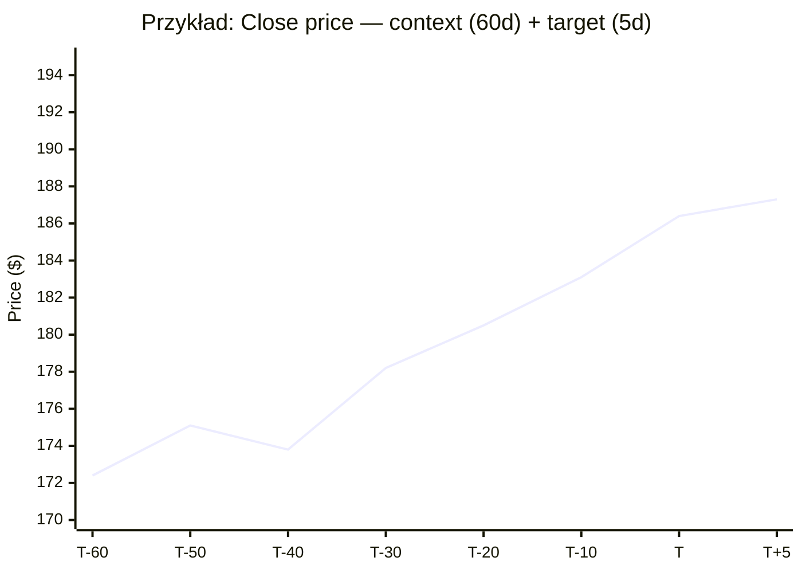
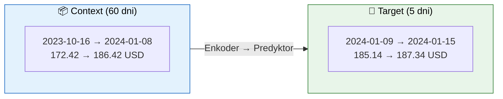

# 📊 Przykłady danych treningowych i użycia modelu

> Konkretne przykłady liczbowe, fragmenty kodu i scenariusze użycia wytrenowanego modelu R-JEPA.

---

## Spis treści

1. [Dane treningowe — przykłady](#1-dane-treningowe--przykłady)
2. [Użycie wytrenowanego modelu](#2-użycie-wytrenowanego-modelu)

---

## 1. Dane treningowe — przykłady

> Konkretne wartości liczbowe dla akcji Apple (AAPL) z okresu 2024-01-02–2024-01-12.

### 1.1 Surowe dane OHLCV (przed normalizacją)

Po pobraniu przez `yfinance` ramka danych wygląda następująco:

| Date       | Open   | High   | Low    | Close  | Volume     |
|------------|--------|--------|--------|--------|------------|
| 2024-01-02 | 185.64 | 188.88 | 184.67 | 185.64 | 75,243,200 |
| 2024-01-03 | 184.22 | 185.88 | 183.43 | 184.25 | 67,891,500 |
| 2024-01-04 | 183.75 | 184.50 | 182.14 | 182.68 | 58,234,100 |
| 2024-01-05 | 182.59 | 183.74 | 181.15 | 181.89 | 54,678,300 |
| 2024-01-08 | 183.56 | 186.48 | 182.87 | 186.42 | 62,345,800 |
| 2024-01-09 | 186.11 | 186.92 | 184.63 | 185.14 | 55,123,400 |
| 2024-01-10 | 185.23 | 187.14 | 184.73 | 186.63 | 51,987,600 |
| 2024-01-11 | 186.78 | 188.40 | 185.31 | 186.10 | 59,456,200 |
| 2024-01-12 | 186.45 | 187.72 | 184.92 | 185.82 | 53,221,900 |

### 1.2 Cechy techniczne (wygenerowane przez `_add_technical_features`)

Po dodaniu wskaźników technicznych dla tego samego okresu:

| Date       | Close  | Returns  | Log_Ret  | MA_5    | MA_20  | RSI_14  | Vol_5    | Vol_Ratio |
|------------|--------|----------|----------|---------|--------|---------|----------|-----------|
| 2024-01-02 | 185.64 | —        | —        | —       | —      | —       | —        | —         |
| 2024-01-03 | 184.25 | -0.0075  | -0.0075  | —       | —      | —       | —        | —         |
| 2024-01-04 | 182.68 | -0.0085  | -0.0085  | —       | —      | —       | —        | —         |
| 2024-01-05 | 181.89 | -0.0043  | -0.0043  | —       | —      | —       | —        | —         |
| 2024-01-08 | 186.42 | +0.0249  | +0.0246  | 184.18  | —      | —       | 0.0147   | —         |
| 2024-01-09 | 185.14 | -0.0069  | -0.0069  | 184.08  | —      | 46.32   | 0.0124   | —         |
| 2024-01-10 | 186.63 | +0.0080  | +0.0080  | 184.55  | —      | 52.17   | 0.0110   | —         |
| 2024-01-11 | 186.10 | -0.0028  | -0.0028  | 185.24  | —      | 50.83   | 0.0126   | —         |
| 2024-01-12 | 185.82 | -0.0015  | -0.0015  | 185.82  | —      | 49.75   | 0.0118   | —         |

> **Uwaga**: `—` oznacza wartości `NaN` — wymagana jest historia do wyliczenia wskaźnika (np. MA_5 potrzebuje 5 dni, RSI_14 potrzebuje 14 dni). [`StockDataLoader`](../data/stock_data.py) automatycznie usuwa wiersze z `NaN` po wygenerowaniu wszystkich cech.

### 1.3 Gotowy zestaw 14 cech wejściowych (znormalizowanych)

Po normalizacji `StandardScaler` i usunięciu `NaN` — każdy wiersz to wektor `d=14`:

```python
import numpy as np

# Przykładowy batch [B=4, T=60, d=14] — 4 sesje po 60 dni, 14 cech
sample_batch = np.array([
    [  # Próbka 1 — trend wzrostowy
        [-0.23,  0.15, -0.10,  0.31,  0.42, -0.05,  0.11,  0.08, -0.33,  0.27,  0.19, -0.44,  0.06,  0.22],
        [-0.18,  0.22, -0.07,  0.35,  0.48, -0.02,  0.15,  0.12, -0.28,  0.31,  0.24, -0.38,  0.11,  0.26],
        # ... (60 kroków czasowych)
    ],
    [  # Próbka 2 — trend boczny
        [ 0.05, -0.03,  0.02, -0.01, -0.08,  0.01, -0.02,  0.00,  0.04, -0.06, -0.03,  0.07, -0.01,  0.00],
        [ 0.02,  0.00, -0.01,  0.03,  0.05, -0.01,  0.00,  0.02, -0.03,  0.01,  0.02, -0.04,  0.03,  0.01],
        # ... (60 kroków czasowych)
    ],
    [  # Próbka 3 — trend spadkowy
        [ 0.61, -0.42,  0.33, -0.55, -0.71,  0.12, -0.24, -0.18,  0.51, -0.39, -0.28,  0.66, -0.15, -0.30],
        [ 0.55, -0.38,  0.29, -0.49, -0.65,  0.09, -0.21, -0.15,  0.47, -0.35, -0.25,  0.59, -0.12, -0.27],
        # ... (60 kroków czasowych)
    ],
    [  # Próbka 4 — wysoka zmienność
        [-0.88,  0.95, -0.91,  0.87, -1.23,  0.45, -0.52,  0.33, -0.77,  0.81,  0.62, -0.95,  0.44, -0.38],
        [ 0.72, -0.68,  0.70, -0.75,  1.01, -0.33,  0.41, -0.28,  0.63, -0.67, -0.51,  0.78, -0.35,  0.31],
        # ... (60 kroków czasowych)
    ],
], dtype=np.float32)

print(f"Batch shape: {sample_batch.shape}")  # (4, 60, 14)
```

### 1.4 Pary context → target

Dla `sequence_length=60`, `prediction_horizon=5`:

```python
# Konkretny przykład: indeks 200 w zbiorze
# context: dni 200..259 (60 dni historii)
# target:  dni 260..264 (5 dni do przewidzenia)

context_data = {
    "date_range": "2023-10-16  →  2024-01-08",
    "close_price_range": "$172.42  →  $186.42",
    "trend": "lekko wzrostowy (+8.1% w 60 dni)",
    "rsi_end": 57.3,   # neutralny
    "volatility": 0.012,  # niska
}

target_data = {
    "date_range": "2024-01-09  →  2024-01-15",
    "close_actual": [185.14, 186.63, 186.10, 185.82, 187.34],
    "close_change": [-0.69%, +0.80%, -0.28%, -0.15%, +0.82%],
}
```

### 1.5 Wizualizacja zbioru treningowego





---

## 2. Użycie wytrenowanego modelu

### 2.1 Ładowanie checkpointa i predykcja w Pythonie

```python
import torch
import numpy as np
import pandas as pd
import yfinance as yf
from pathlib import Path

from models.r_jepa import RJEPA
from data.stock_data import StockDataLoader, StockDataConfig

# ------------------------------------------------------------
# 1. Wczytanie wytrenowanego modelu z checkpointa
# ------------------------------------------------------------
device = torch.device("cuda" if torch.cuda.is_available() else "cpu")

ckpt_path = Path("checkpoints/checkpoint_best.pt")
ckpt = torch.load(ckpt_path, weights_only=True, map_location=device)

# Rekonstrukcja modelu — parametry muszą być identyczne jak w treningu
model = RJEPA(
    input_dim=14,                # 14 cech po inżynierii
    encoder_hidden_dim=128,
    encoder_num_layers=2,
    latent_dim=64,
    predictor_hidden_dim=128,
    predictor_num_layers=2,
    predictor_dropout=0.1,
    decoder_hidden_dim=64,
    decoder_output_dim=5,
    momentum_tau=0.996,
).to(device)

model.load_state_dict(ckpt["model_state_dict"])
model.eval()

print(f"✅ Model załadowany z {ckpt_path}")
print(f"   Epoka: {ckpt['epoch']}, Val Loss: {ckpt['best_val_loss']:.6f}")
```

### 2.2 Pobranie świeżych danych i predykcja

```python
# ------------------------------------------------------------
# 2. Pobranie ostatnich 60 dni dla wybranego tickera
# ------------------------------------------------------------
ticker = "AAPL"
df = yf.download(ticker, period="3mo", interval="1d")

# Wytnij ostatnie 60 dni jako context
sequence_length = 60
recent = df.tail(sequence_length).copy()

print(f"Context: {recent.index[0].date()} → {recent.index[-1].date()}")
print(f"Kurs zamknięcia: ${recent['Close'].iloc[0]:.2f} → ${recent['Close'].iloc[-1]:.2f}")

# ------------------------------------------------------------
# 3. Inżynieria cech (użyj StockDataLoader)
# ------------------------------------------------------------
config = StockDataConfig(
    tickers=(ticker,),
    start_date=str(recent.index[0].date()),
    end_date=str(recent.index[-1].date()),
    sequence_length=sequence_length,
    features=("Open", "High", "Low", "Close", "Volume"),
)
loader = StockDataLoader(config)
data = loader.preprocess()  # NDArray [N, d=14]

# Ostatnia sekwencja jako tensor
context_tensor = torch.from_numpy(data[-sequence_length:]).float()  # [60, 14]
context_batch = context_tensor.unsqueeze(0).to(device)              # [1, 60, 14]

# ------------------------------------------------------------
# 4. Forward pass — predykcja
# ------------------------------------------------------------
prediction_horizon = 5

with torch.no_grad():
    output = model.predict(
        context=context_batch,
        prediction_horizon=prediction_horizon,
        return_ensemble=True,
        ensemble_size=20,
        noise_scale=0.05,
    )

# output zawiera:
#   predictions — średnia ensemble [1, 5, 5]
#   ensemble    — wszystkie trajektorie [1, 20, 5, 5]
#   upper_bound — górna granica 95% CI [1, 5, 5]
#   lower_bound — dolna granica 95% CI [1, 5, 5]
```

### 2.3 Interpretacja wyników

```python
# ------------------------------------------------------------
# 5. Inverse transform i odczyt predykcji
# ------------------------------------------------------------
predictions = output["predictions"].cpu().numpy()[0]      # [5, 5]
upper = output["upper_bound"].cpu().numpy()[0]             # [5, 5]
lower = output["lower_bound"].cpu().numpy()[0]             # [5, 5]

# Inverse transform — użyj skalera z StockDataLoader
pred_df = pd.DataFrame(
    predictions,
    columns=["Open", "High", "Low", "Close", "Volume"],
)
pred_original = loader.inverse_transform(pred_df.values)

print("📈 Predykcja na najbliższe 5 sesji:")
print("-" * 60)
for i in range(prediction_horizon):
    close_pred = pred_original[i, 3]  # Close
    close_low = lower[i, 3]
    close_high = upper[i, 3]
    print(f"  Dzień {i+1}: Close = ${close_pred:.2f}  "
          f"(95% CI: ${close_low:.2f}–${close_high:.2f})")
```

**Przykładowy wydruk**:
```
📈 Predykcja na najbliższe 5 sesji:
------------------------------------------------------------
  Dzień 1: Close = $187.34  (95% CI: $185.12–$189.56)
  Dzień 2: Close = $187.92  (95% CI: $184.78–$191.06)
  Dzień 3: Close = $188.15  (95% CI: $184.22–$192.08)
  Dzień 4: Close = $188.51  (95% CI: $183.89–$193.13)
  Dzień 5: Close = $188.73  (95% CI: $183.45–$194.01)
```

> **Interpretacja**: Model przewiduje stabilny wzrost z $187.34 do $188.73 w ciągu 5 dni. Szerokość przedziałów ufności rośnie z każdym krokiem (+/-$2.44 → +/-$5.28), co odzwierciedla rosnącą niepewność dla dalszych horyzontów.

### 2.4 Batch prediction — wiele akcji jednocześnie

```python
# ------------------------------------------------------------
# Predykcja dla portfela 3 akcji
# ------------------------------------------------------------
tickers = ["AAPL", "MSFT", "GOOGL"]
batch_contexts = []

for t in tickers:
    df = yf.download(t, period="3mo", interval="1d")
    config = StockDataConfig(
        tickers=(t,), start_date=str(df.index[0].date()),
        end_date=str(df.index[-1].date()),
    )
    loader = StockDataLoader(config)
    data = loader.preprocess()
    seq = torch.from_numpy(data[-sequence_length:]).float().to(device)
    batch_contexts.append(seq)

batch = torch.stack(batch_contexts, dim=0)  # [3, 60, 14]

with torch.no_grad():
    out = model.predict(batch, prediction_horizon=5,
                        return_ensemble=True, ensemble_size=20)

for i, t in enumerate(tickers):
    price = out["predictions"][i, -1, 3].item()  # ostatni Close
    ci = out["upper_bound"][i, -1, 3].item() - out["lower_bound"][i, -1, 3].item()
    print(f"{t:6s}: Close Day 5 = ${price:.2f} (CI width = ${ci:.2f})")
```

**Przykładowy wydruk**:
```
AAPL  : Close Day 5 = $188.73 (CI width = $10.56)
MSFT  : Close Day 5 = $415.21 (CI width = $14.82)
GOOGL : Close Day 5 = $175.44 (CI width = $11.34)
```

### 2.5 Export predykcji do plików

```python
# ------------------------------------------------------------
# Zapis do CSV
# ------------------------------------------------------------
import csv
from datetime import datetime, timedelta

last_date = recent.index[-1]
rows = []

for i in range(prediction_horizon):
    date = (last_date + timedelta(days=i + 1)).strftime("%Y-%m-%d")
    rows.append({
        "date": date,
        "ticker": ticker,
        "open_pred": pred_original[i, 0],
        "high_pred": pred_original[i, 1],
        "low_pred": pred_original[i, 2],
        "close_pred": pred_original[i, 3],
        "volume_pred": int(pred_original[i, 4]),
        "close_lower_ci": lower[i, 3],
        "close_upper_ci": upper[i, 3],
    })

with open("predictions_aapl.csv", "w", newline="") as f:
    writer = csv.DictWriter(f, fieldnames=rows[0].keys())
    writer.writeheader()
    writer.writerows(rows)

print("✅ Zapisano predictions_aapl.csv")

# ------------------------------------------------------------
# Zapis do JSON (dla API/web)
# ------------------------------------------------------------
import json

payload = {
    "ticker": ticker,
    "generated_at": datetime.now().isoformat(),
    "context_end": str(last_date.date()),
    "horizon": prediction_horizon,
    "predictions": [
        {
            "day": i + 1,
            "close": round(float(pred_original[i, 3]), 2),
            "ci_95": {
                "lower": round(float(lower[i, 3]), 2),
                "upper": round(float(upper[i, 3]), 2),
            },
        }
        for i in range(prediction_horizon)
    ],
}

with open("predictions_aapl.json", "w") as f:
    json.dump(payload, f, indent=2)

print("✅ Zapisano predictions_aapl.json")
```

### 2.6 Użycie z konsoli — skrypt `run_prediction.py`

```bash
# Podstawowa predykcja dla AAPL
python run_prediction.py \
    --checkpoint checkpoints/checkpoint_best.pt \
    --ticker AAPL \
    --horizon 5

# Predykcja z ensemble (20 trajektorii) i zapisem do CSV/PNG
python run_prediction.py \
    --checkpoint checkpoints/checkpoint_best.pt \
    --ticker MSFT \
    --horizon 10 \
    --ensemble_size 20 \
    --output predictions_msft.csv

# Predykcja z własnym zakresem dat
python run_prediction.py \
    --checkpoint checkpoints/checkpoint_best.pt \
    --ticker AAPL \
    --start 2024-06-01 \
    --end 2024-12-31 \
    --horizon 5 \
    --ensemble_size 50 \
    --output predictions_aapl.png
```

### 2.7 Użycie w notebooku Jupyter

```python
# W komórce notebooka — pełny pipeline predykcyjny
import matplotlib.pyplot as plt
from utils.metrics import plot_predictions

# Zakładając, że mamy output z model.predict(...)
plot_predictions(
    historical=recent["Close"].values,
    predictions=pred_original[:, 3],       # Close
    upper_bound=upper[:, 3],
    lower_bound=lower[:, 3],
    title=f"{ticker} — R-JEPA Price Prediction",
    save_path="prediction_plot.png",
)

plt.show()
```
